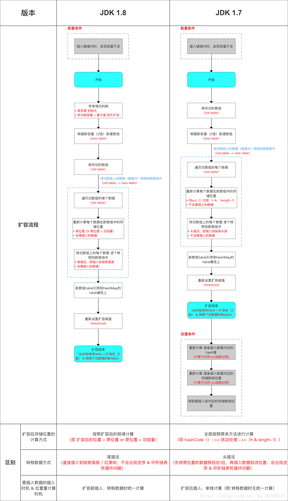

[(Java)重载,重写以及继承,多态的区别](https://www.cnblogs.com/cugwx/p/3650605.html)
[C++重写(覆盖)、重载、重定义、多态](https://www.cnblogs.com/DannyShi/p/4593735.html)
[Java 泛型](https://www.cnblogs.com/1175429393wljblog/p/5865500.html)
[浅谈JVM内存模型](https://blog.csdn.net/one_jachen/article/details/78157209)
[（1）美团面试题：Hashmap的结构，1.7和1.8有哪些区别，史上最深入的分析](https://blog.csdn.net/qq_36520235/article/details/82417949)
[Java集合框架概述](https://husteryp.github.io/2018/08/26/Java集合框架概述/)
[Java中volatile关键字的最全总结](https://blog.csdn.net/u012723673/article/details/80682208)

[TOC]

### 基础知识

#### [Java字节码](https://blog.csdn.net/dc_726/article/details/7944154)

#### 环境变量配置

- 新增变量名: JAVA_HOME，变量值: C:\Program Files (x86)\Java\jdk1.8.0_91 //具体根据你的jdk路径为主
- 新增变量名: CLASSPATH，变量值: .;%JAVA_HOME%\lib\dt.jar;%JAVA_HOME%\lib\tools.jar;
- 修改添加变量名: PATH，变量值: %JAVA_HOME%\bin;%JAVA_HOME%\jre\bin;

> 注意: 如果使用1.5以上版本的JDK，不用设置CLASSPATH环境变量，也可以正常编译和运行Java程序。

#### 基本cmd

- javac HelloWorld.java: 编译HelloWorld.java文件，生成class字节码文件。
- java HelloWorld: 运行HelloWorld.class文件，注意指令后面不需要添加.class命令。

#### Java语言的特点

- 面向对象: java只支持类的单继承、接口之间的多继承、类与接口之间的实现机制
- 简单: 没有C/C++那样使用起来非常繁琐的指针，而是引用，并提供废料收集的内存回收机制，我们不必为内存管理而担忧
- 健壮: 强类型转换(适合大型程序的开发)、异常处理、垃圾回收机制都是java程序健壮型的保障
- 可移植: java系统本身具有很强的可移植性，java编译器是用Java实现的，java的运行环境是用ANSI C实现的。
	任何一个java程序，不论它运行在何种cpu、操作系统或者java编译器上都产生一样的结果。
	- java虚拟机提供了cpu可移植性。大多数编译器产生的目标代码只能运行在一种cpu(如Intel的x86系列)。
		即使那种支持多种编译器的目标代码，也不能产生适合多种cpu的目标代码。
		而java不一样，java编译器产生的目标代码针对的是一种并不存在的cpu--java虚拟机，而不是一种具体的cpu。
		java虚拟机能掩盖不同cpu之间的差别，从而使java-code运行在安装有虚拟机的机器上。
	- java作为一种虚拟的操作系统和图形用户界面: 操作系统的可移植。
		由于java能提供与平台无关的库函数，所以不会像c/c++那样在windows下引用大量WindowsAPI和中断调用后而无法适应Unix体系的操作系统。
		不同操作系统对c/c++提供的API是不一样的，但是基于java虚拟机的java却可以无视这些。
- 多线程: java线程创建通常有三种方式，一种是继承Thread，一种是实现Runnable，一种是Callable

#### 命名规范

- 大小写敏感: 所有的命名都区分大小写
- 类名: 每个单词首写字母为大写字母
- 方法名: 所有方法都以小写字母开头
- 类文件名: 类文件名必须和类名相同
- 程序主入口: 所有程序都从public static void main(String[] args)方法开始执行

#### 标识符

类名、方法名、变量名都称为标识符

- 所有标识符都以字母(a-z或A-Z)、美元符($)、下划线开头(\_)
- 首字符之后可以是字母、美元符、下划线、数字
- 关键字不能作为标识符
- 标识符区分大小写

#### 变量类型

- 成员变量: 在类中，方法体之外定义的变量，存在堆内存中
- 局部变量: 在方法、构造方法、语句块定义的变量(如果是类实例，则是地址，然后指向堆中一个区域)，存在栈内存中
- 静态变量(类变量): 在类中，方法体之外定义的变量，但必须由static关键字修饰，存在静态存储区(方法区)

#### 基本数据类型

- 四种数字类型: byte(1个字节)、short(2个字节)、int(4个字节)、long(8个字节)
- 两种浮点型: float(4个字节)、double(8个字节)
- 一种布尔型: boolean(false和true)
- 一种字符型: char(2个字节)

#### Java类与接口、类与类之间的六种关系

- 继承: Java中的类继承不同于C++中的类继承，Java中的类能且只能继承另外一个类，可以在原有父类的基础上添加自己的新功能。(extends关键字)
- 实现: 通过定义一个具有规范的方法的接口，让一个类来实现这接口规定实现的方法就能具有规范的功能。(implements关键字)
- 依赖: 指一个类实现时使用到了另一个类的实例，但这种使用关系具有偶然性、临时性、非常弱的。当然，被使用类的变化还是会影响到使用类的。
- 关联: 相当于强依赖关系，不存在依赖关系的偶然性、临时性，一般是长期性的，而且双方的关系一般是平等的。关联可以是单向、双向的。
	被关联类B常以属性形式被关联类A使用，或者一个全局的B实例变量被A引用。
- 聚合: has-a关系，即部分与整体的关系，此时整体与部分之间是可分离的，它们可以具有各自的生命周期，部分可以属于多个整体对象，也可以为多个整体对象共享。
- 组合: contains-a关系，这种关系比聚合更强，也称为强聚合。这里的整体与部分是不可分离的，整体的生命周期结束也就意味着部分的生命周期结束。

继承、实现这两种关系没多少疑问，它们体现的是类和类、类与接口之间的纵向关系。
其他的四种关系体现的是类与类、或者类与接口之间的引用、横向关系，是比较难区分的，有很多事物间的关系要想准确定位是很难的。
这四种关系都是语义级别的，所以从代码层面并不能完全区分各种关系，但总的来说，后几种关系所表现的强弱程度依次为: 组合>聚合>关联>依赖。

#### 访问控制修饰符

修饰符 | 当前类 | 同一包内 | 子孙类 | 其他包
:- |:- |:- |:- |:-
public | √ | √ | √ | √
protected | √ | √ | √ | ×
default | √ | √ | × | ×
private | √ | × | × | ×

> private: 不能修饰类和接口<br/>
> protected: 不能修饰类和接口，能修饰方法和成员变量，但不能修饰接口的成员方法和成员变量

#### 非访问修饰符

- static:
	- 修饰的变量被所有类实例共享，静态变量只有一个，局部变量不能声明static变量；
	- 修饰的方法不能使用非静态变量，而且可以直接用"类名.静态方法名"这样的形式里调用方法，不用实例化类；
	- 修饰的静态代码块将多个类成员放在一起初始化，使得程序更加规整，其中理解对象的初始化过程非常关键；
	- 静态导包用法，将类的方法直接导入到当前类中，从而直接使用"方法名"即可调用类方法，更加方便。(import static package_name)
- final: 在java中，final的含义在不同的场景下有细微的差别，但总体上来说，它指的是"这是不可变的"。下面，我们来讲final的四种主要用法。
	- 修饰变量: 在java中，用final关键字修饰的变量，只能进行一次赋值操作，并且在生存期内不可以改变它的值。但是修饰引用变量时，引用变量的成员变量可以改变。
		同时使用static和final修饰的成员在内存中只占据一段不能改变的存储空间。只是指引用。<br/>
		对于final修饰的成员变量，我们有且只有两个地方可以给它赋值，一个是声明该成员时赋值，另一个是在构造方法中赋值，在这两个地方我们必须给它们赋初始值。
	- 修饰方法参数: 表示在整个方法中，我们不会(实际上是不能)改变参数的值。
	- 修饰方法: 表示该方法不能被覆盖，类中所有的private方法都隐式地指定为是final的，由于无法在类外使用private方法，所以也就无法覆盖它。
	- 修饰类: final修饰的类是无法被继承的。
- abstract:
	- 抽象类: 不能用来实例化，一个类不能同时被abstract和final修饰
	- 抽象方法: 不能被声明成final和static，抽象方法必须在抽象类中出现
- synchronized: 修饰的方法/代码块同一时间只能被一个线程访问
- transient: 修饰的变量在序列化后无法获得访问。Java的serialization提供了一种持久化对象实例的机制。
	当持久化对象时，可能有一个特殊的对象数据成员，我们不想用serialization机制来保存它。
	为了在一个特定对象的一个域上关闭serialization，可以在这个域前加上关键字transient。
	当一个对象被串行化的时候，transient型变量的值不包括在串行化的表示中，然而非transient型的变量是被包括进去的，即使是static变量。
- volatile: 修饰的成员变量在每次被线程访问时，都强迫从主内存中重读该成员变量的值。而且，当成员变量发生变化时，强迫线程将变化值回写到主内存。
	这样在任何时刻，两个不同的线程总是看到某个成员变量的同一个值。在两个或者更多的线程访问的成员变量上使用volatile。
	当变量已在synchronized代码块中或者为常量时，不必使用。因为使用volatile屏蔽掉了VM中必要的代码优化，所以在效率上比较低，因此一定在必要时才使用此关键字。
	- 直接使用volatile修饰的引用，操作对象的话，对象值的任何改变都是线程可见的，都会刷新主存，无效其他线程的缓存。
- volatile与synchronized: 
	- volatile本质是在告诉jvm当前变量在寄存器（工作内存）中的值是不确定的，需要从主存中读取； synchronized则是锁定当前变量，只有当前线程可以访问该变量，其他线程被阻塞住。
	- volatile仅能使用在变量级别；synchronized则可以使用在变量、方法、和类级别的
	- volatile仅能实现变量的修改可见性，不能保证原子性；而synchronized则可以保证变量的修改可见性和原子性
	- volatile不会造成线程的阻塞；synchronized可能会造成线程的阻塞。
	- volatile标记的变量不会被编译器优化；synchronized标记的变量可以被编译器优化

#### 重写

- 重写的访问修饰符大于等于父类
- 重写抛出的异常小于等于父类
- 不能重写构造方法
- 不能重写被final或static或private修饰的方法

#### 重载

- 重载发生在编译时
- 重载的方法名必须相同
- 重载的参数或参数个数或参数顺序必须不同
- 重载的返回类型可以不同
- 重载的访问修饰符可以不同

#### 多态

```java
Parent a = new Son();
a.doSomething();
```

编译器会寻找父类是否有doSometing方法，如果有，则执行子类的doSometing方法，如果没有，则编译报错。

#### 接口与抽象类

- 接口: 接口中每个方法默认被public abstract修饰；接口每个变量默认被public static final修饰
- 抽象类: 抽象类不能被实例化；抽象类不一定包含抽象方法，但有抽象方法一定是抽象类；抽象类可以声明抽象方法，也可以包含方法体；构造方法，类方法不能声明抽象
- 区别: 
	- 抽象类中的方法可以有方法体，而接口不行
	- 抽象类中的成员变量可以是各种类型，而接口不行
	- 抽象类中可以有静态代码和静态方法，而接口不行
	- 抽象类所体现的是继承关系，接口仅仅实现接口定义的契约

#### 集合、数组

##### 基本集合了解

集合结构:

- Collection接口: 提供子类接口继承，List接口和Set接口继承自Collection接口
- List接口: 有序、key和value可重复，可以动态增长，查找效率高、插入删除效率低。(实现类: ArrayList、LinkedList、Vector)
- Set接口: 无序、key和value不可重复，查找效率慢、插入删除效率高。(实现类: HashSet、TreeSet)
- Map接口: 无序、key唯一、value可重复。(实现类: HashMap、TreeMap、Hashtable)
- 注意: TreeSet和TreeMap都是有序的

##### Array/Arrays、Collection/Collections

Array与Arrays:

- 数组类Array: Java中最基本的一个存储结构。提供了动态创建和访问Java数组的方法。其中的元素的类型必须相同。效率高，但容量固定且无法动态改变。它无法判断其中实际存有多少元素，length只是告诉我们array的容量。
- 静态类Arrays: 此静态类专门用来操作array ，提供搜索、排序、复制等静态方法。equals(): 比较两个array是否相等。array拥有相同元素个数，且所有对应元素两两相等。sort(): 用来对array进行排序。binarySearch(): 在排好序的array中寻找元素。Arrays.asList(array):将数组array转化为List

Collection与Collections:

- Collection是一个集合接口(集合类的一个顶级接口)。它提供了对集合对象进行基本操作的通用接口方法。Collection接口在Java类库中有很多具体的实现。Collection接口的意义是为各种具体的集合提供了最大化的统一操作方式
- Collections则是集合类的一个工具类/帮助类，其中提供了一系列静态方法，用于对集合中元素进行排序、搜索以及线程安全等各种操作。
	```java
	Collections.sort(list);
	Collections.Shuffling(list);
	Collections.reverse(list);
	Collections.fill(list, Object);	// 用Object替换list里面的所有元素
	Collections.copy(targetList, sourceList);	// 目标list至少与源一样长。
	Collections.min(list);
	Collections.max(list);
	Collections.lastIndexOfSubList(list1, list2);
	Collections.indexOfSubList(list1, list2);
	Collections.rotate(list, -1);	// 根据指定的距离循环移动指定列表中的元素，如果是负数，则正向移动，正数则方向移动
	```

##### 集合深入了解(一) List

1. **ArrayList**: https://blog.csdn.net/ITermeng/article/details/72725878
	1. 特点: 
		1. **动态数组**，容量动态增长
		2. **允许包括null在内的所有元素**
		3. **List接口的非同步实现**
		4. **有序的**
	2. 自动增长会带来数据向新数组的重新拷贝，因此，如果可预知数据量的多少，可在**构造时指定其容量**。在添加大量元素前，也可以使用**ensureCapacity**操作来增加ArrayList实例的容量，这可以减少递增式再分配的数量
	3. 继承与实现: 
		1. 继承了AbstractList抽象类，它**是一个数组队列，提供了相关的添加、删除、修改、遍历等功能**
		2. 实现了List接口、**底层使用数组保存所有元素**，其操作基本上是对数组的操作
		3. 实现了RandmoAccess接口，即提供了**随机访问功能**，RandmoAccess是java中用来被List实现，为List提供快速访问功能的，我们可以通过元素序号快速获取元素，即快速随机访问
		4. 实现了Cloneable接口，即覆盖了函数clone()，能被**深克隆**
		5. 实现了java.io.Serializable，**可序列化**
	4. 源码:
		1. 构造函数: ArrayList()(默认10) ArrayList(int capacity) ArrayList(Collection<?> c)
		2. 调整容量: ensureCapacityInternal(int minCapacity) grow(minCapacity)(每次增长1.5倍)
		3. 存储: set(int index, T obj) add(T obj) add(int index, T obj) addAll(Collection<?> c) addAll(int index, Collection<?> c)
		4. 删除: remove(index) remove(T obj)
		5. 读取: get(index)
		6. 其他: rangeCheck(int index) trimToSize()
	5. **ArrayListFail-Fast机制**: 在面对并发的修改时，迭代器很快就会完全失败。通过记录modCount参数，ArrayList能避免这个问题。
2. **LinkedList**: https://blog.csdn.net/qq_30379689/article/details/72764566
	1. 特点: 
		1. **fail-fast机制的**
		2. **允许包括null在内的所有元素**
		3. **List接口的非同步实现**
		4. **有序的**
	2. 继承与实现: 
		1. 实现了List接口，**底层基于链表，插入与删除比ArrayList快，但随机访问效率低**
		2. 继承了AbstractSequenceList抽象类，**提供了List接口骨干性的实现以减少实现List接口的复杂度**
		3. 实现了Deque接口，**定义了双端队列的操作**，双端队列是一种具有队列和栈的性质的数据结构，双端队列中的元素可以从两端弹出，其限定插入和删除操作在表的两端进行
		4. 实现了Cloneable接口，即覆盖了函数clone()，能被**克隆**
		5. 实现了java.io.Serializable接口，意味着ArrayList支持**序列化**
	3. 源码: 
		1. Node: item last first(**双向链表**)
		2. 存储: add(T obj) add(int index, T obj) addFirst(T obj) addLast(T obj)
		3. 删除: removeFirst() removeLast()
		4. 读取: get(index)(慢)
3. **Vector**: 加了synchronized的ArrayList？？？
4. **Stack**: 

##### 集合深入了解(二) Set

1. **HashSet**: 
	1. 特点: **无序的，基于HashMap实现的，将对象存储在key中，不允许key重复的，value是固定的，浅复制**。
	2. 源码:
		1. 构造函数: HashSet() HashSet(Collection<?> e) HashSet(int initialCapacity, float loadFactor) HashSet(int initialCapacity) HashSet(int initialCapacity, float loadFactor, boolean dummy)(这个protected 用于LinkedHashSet)
		2. 存储: add(E e) addAll(Collection<?> e)
		3. 其他: contains(Object o) remove(Object o) clone()
	3. 和HashMap区别: 
		1. **接口**: HashMap实现了Map；HashSet实现了Set
		2. **存储对象**: HashMap存储了键值对；HashSet仅仅存储对象
		3. **添加方法**: HashMap.put；HashSet.add
		4. **hashcode**: HashMap中使用键对象来计算hashcode值；HashSet使用成员对象来计算hashcode值
		5. **速度**: HashMap比较快，因为是使用唯一的键来获取对象；HashSet较HashMap来说比较慢
2. **LinkedHashSet**: 
	1. 特点: **非同步的；有序的，分别是插入顺序和访问顺序；继承于HashSet，内部基于LinkedHashMap实现的，也就是说LinkedHashSet和HashSet一样只存储一个值，LinkedHashSet和LinkedHashMap一样维护着一个运行于所有条目的双向链表**
3. **TreeSet**: 
4. **ConcurrentSkipListSet**: 

##### 集合深入了解(三) Map

1. **TreeMap**: 
2. **HashMap**: https://blog.csdn.net/qq_30379689/article/details/72582279
	1. 特点: **基于哈希表的Map接口的非同步实现；元素的key是唯一的、value值可重复；允许使用null值和null键；无序的；拉链法的哈希**
	2. 源码:
		1. 拉链结构: Map.Entry<K, V> key value next hash
		2. 存储: put(K, V) putForNullKey(V) addEntry(int hash, K, V, int bucketIndex) createEntry(int hash, K, V, int bucketIndex)
		3. 读取: get(K) getForNullKey() getEntry(Object key)
		4. **hash**: 根据key的hashCode重新计算一次散列。此算法加入了高位计算，防止低位不变，高位变化时，造成的hash冲突
			```java
			final int hash(Object k) {
				int h = 0;
				if (useAltHashing) {
					if (k instanceof String)
						return sun.misc.Hashing.stringHash32((String) k);
					h = hashSeed;
				}
				// 得到k的hashcode值
				h ^= k.hashCode();
				// 进行计算
				h ^= (h >>> 20) ^ (h >>> 12);
				return h ^ (h >>> 7) ^ (h >>> 4);
			}
			```
		5. **容量**: 把hash值对数组长度取模运算，这样一来，元素的分布相对来说是比较均匀的。但是，“模”运算的消耗还是比较大的。所以在HashMap中是调用indexFor(int h, int length)方法来计算该对象应该保存在table数组的哪个索引处: return h & (length-1);<br>
			这个方法非常巧妙，它通过 h & (table.length -1) 来得到该对象的保存位，而HashMap底层数组的长度总是 2 的 n 次方，这是HashMap在速度上的优化。<br>
			table.length必须是2的n次方，然后table.length - 1所有位都是1了，然后可以利用到全部空间
		6. **resize(rehash)**: 当HashMap中的元素个数超过（数组大小 *loadFactor）时，就会进行数组扩容，loadFactor指的是负载因子。默认数组大小16，负载因子0.75
		7. 构造函数: HashMap() HashMap(int initialCapacity) HashMap(int initialCapacity, float loadFactor)
		8. **fail-fast机制**: HashMap不是线程安全的，因此在使用迭代器的过程中有其他线程修改了map，那么将抛出 ConcurrentModificationException，这就是所谓 fail-fas机制，
			fail-fast机制是 java 集合(Collection)中的一种错误机制，当多个线程对同一个集合的内容进行操作时，就可能会产生fail-fast事件。<br>
			这一机制在源码中的实现是通过**modCount**域(修改次数)，对HashMap内容进行修改时都将增加这个值，那么在迭代器初始化过程中会将这个值赋给迭代器的**expectedModCount**
			```java
			HashIterator() {
				expectedModCount = modCount;
				if (size > 0) { // advance to first entry
					Entry[] t = table;
					while (index < t.length && (next = t[index++]) == null) ;
				}
			}
			```
			在迭代过程中，判断modCount跟expectedModCount是否相等，如果不相等就表示已经有其他线程修改了Map。同时，modCount声明为volatile，保证了线程之间修改的可见性<br>
			在迭代器创建之后，如果从结构上对映射进行修改，除非通过**迭代器本身的remove**方法，其他任何时间任何方式的修改，迭代器都将抛出ConcurrentModificationException。因此，面对并发的修改，迭代器很快就会完全失败，而不冒在将来不确定的时间发生任意不确定行为的风险。<br>
			注意，**迭代器的快速失败行为不能得到保证**，一般来说，存在非同步的并发修改时，不可能作出任何坚决的保证。快速失败迭代器尽最大努力抛出ConcurrentModificationException。因此，编写依赖于此异常的程序的做法是错误的，正确做法是: 迭代器的快速失败行为应该仅用于检测程序错误
		9. **fail-fast机制解决方法**: 在上文中也提到，fail-fast 机制，是一种错误检测机制。它只能被用来检测错误，因为JDK并不保证fail-fast机制一定会发生。若在多线程环境下使用 fail-fast 机制的集合，建议使用“java.util.concurrent 包下的类”去取代“java.util 包下的类”
		10. 两种遍历模式: 
			```java
			// 效率高
			Map map = new HashMap();
			Iterator iter = map.entrySet().iterator();
			while (iter.hasNext()) {
			　　Map.Entry entry = (Map.Entry) iter.next();
			　　Object key = entry.getKey();
			　　Object val = entry.getValue();
			}
			// 效率低
			Map map = new HashMap();
			Iterator iter = map.keySet().iterator();
			while (iter.hasNext()) {
			　　Object key = iter.next();
			　　Object val = map.get(key);
			}
			```
	3. 1.8改进: 
		1. JDK1.7用的是头插法，而JDK1.8及之后使用的都是尾插法；因为JDK1.7是用单链表进行的纵向延伸，当采用头插法时会容易出现逆序且环形链表死循环问题。但是在JDK1.8之后是因为加入了红黑树使用尾插法，能够避免出现逆序且链表死循环的问题。
		2. 扩容后数据存储位置的计算方式也不一样: 
			<div class="align"></div>
			1. 在JDK1.7的时候是直接用hash值和需要扩容的二进制数进行&(这里就是为什么扩容的时候为啥一定必须是2的多少次幂的原因所在，因为如果只有2的n次幂的情况时最后一位二进制数才一定是1，这样能最大程度减少hash碰撞)(hash值 & length-1)
			2. 而在JDK1.8的时候直接用了JDK1.7的时候计算的规律，也就是扩容前的原始位置+扩容的大小值=JDK1.8的计算方式，而不再是JDK1.7的那种异或的方法。但是这种方式就相当于只需要判断Hash值的新增参与运算的位是0还是1就直接迅速计算出了扩容后的储存方式。
			3. 在计算hash值的时候，JDK1.7用了9次扰动处理=4次位运算+5次异或，而JDK1.8只用了2次扰动处理=1次位运算+1次异或。
			4. JDK1.7的时候使用的是数组+ 单链表的数据结构。但是在JDK1.8及之后时，使用的是数组+链表+红黑树的数据结构(当链表的深度达到8的时候，也就是默认阈值，就会自动扩容把链表转成红黑树的数据结构来把时间复杂度从O(n)变成O(logN)提高了效率)
3. **HashTable**: 加了synchronized的HashMap
	1. 特点: **基于哈希表的Map接口的同步实现；key是唯一的，value值可重复；key和value不允许为null，如果遇到null，则返回NullPointerException；无序的；同步安全的**
	2. 继承与实现: 继承于Dictionary(已过时)类，实现了Map, Cloneable, Serializable接口
	3. 源码: 
		1. 成员变量: 
			1. table: 一个Entry[]数组类型，而Entry（在 HashMap 中有讲解过）就是一个单向链表。哈希表的”key-value键值对”都是存储在Entry数组中的
			2. count: Hashtable的大小，它是Hashtable保存的键值对的数量
			3. threshold/loadFactor/modCount
		2. 构造方法: Hashtable(int initialCapacity, float loadFactor) Hashtable(int initialCapacity) Hashtable() Hashtable(Map<? extends K, ? extends V> t)
		3. 存储: synchronized put(K, V) synchronized get(K)
		4. index = (hash & 0x7FFFFFFF) % tab.length
		5. 遍历:
			1. Enumeration<String> keys = table.keys(); keys.hasMoreElement/nextElement
			2. Enumeration<String> values = table.elements();
			3. Iterator<String> it1 = table.keySet().iterator(); it1.hasNext/next
			3. Iterator<Entry<String, String>> it1 = table.entrySet().iterator(); it1.hasNext/next
		6. 与HashMap区别: 
			1. **安全**: Hashtable方法是同步的，而HashMap不是
			2. **接口**: Hashtable基于Dictonary，而HashMap基于Map
			3. **Null**: Hashtable的key与value都不能为空，而HashMap可以
			4. **容量**: Hashtable的初始容量是11，扩充方式是old\*2+1；而HashMap初始是16，后续是old\*2
		7. 多线程问题: 
			1. 如果涉及到多线程同步时，建议采用HashTable
			2. 没有涉及到多线程同步时，建议采用HashMap
			3. Collections 类中存在一个静态方法: synchronizedMap()，该方法创建了一个线程安全的 Map 对象，并把它作为一个封装的对象来返回；synchronizedMap()其实就是对Map的方法加层同步锁，从源码中可以看出。
4. **LinkedHashMap**: https://blog.csdn.net/qq_30379689/article/details/72637922
	1. 特点: **基于哈希表的Map接口的非同步实现；是HashMap的子类；是有序的；元素的key是唯一的、value值可重复；允许null键和null值；底层使用哈希表与双向链表来保存所有元素**
	2. 有序性: 底层使用哈希表与双向链表来保存所有元素，它维护着一个运行于所有条目的双向链表，此链表定义了迭代顺序，该迭代顺序可以是插入顺序或者是访问顺序。
		1. 按插入顺序的链表: 在LinkedHashMap调用get方法后，输出的顺序和输入时的相同，这就是按插入顺序的链表，默认是按插入顺序排序
		2. 按访问顺序的链表：在LinkedHashMap调用get方法后，会将这次访问的元素移至链表尾部，不断访问可以形成按访问顺序排序的链表。简单的说，按最近最少访问的元素进行排序(类似LRU算法)
	3. 源码: 
		1. 构造函数: LinkedHashMap() LinkedHashMap(int initCapa) LinkedHashMap(int initCapa, float loadFactor) LinkedHashMap(Collection<?> e) LinkedHashMap(int initCapa, float loadFactor, bool 访问顺序?=false)
		2. 数据结构: LinkedHashMap采用的hash算法和HashMap相同，但是它重新定义了数组中保存的元素Entry，该Entry除了保存当前对象的引用外，还保存了其上一个元素before和下一个元素after的引用，从而在哈希表的基础上又构成了双向链接列表
		3. 存储: ...
		4. 读取: ...
5. **WeakHashMap**: 
6. **ConcurrentHashMap**: 
	1. 底层采用分段的数组+链表实现，线程安全
	2. 通过把整个Map分为N个Segment，可以提供相同的线程安全，但是效率提升N倍，默认提升16倍。(读操作不加锁，由于HashEntry的value变量是volatile的，也能保证读取到最新的值。)
	3. Hashtable的synchronized是针对整张Hash表的，即每次锁住整张表让线程独占，ConcurrentHashMap允许多个修改操作并发进行，其关键在于使用了锁分离技术
	4. 有些方法需要跨段，比如size()和containsValue()，它们可能需要锁定整个表而而不仅仅是某个段，这需要按顺序锁定所有段，操作完毕后，又按顺序释放所有段的锁
	5. **扩容**: 段内扩容（段内元素超过该段对应Entry数组长度的75%触发扩容，不会对整个Map进行扩容），插入前检测需不需要扩容，有效避免无效扩容
	6. **锁分段技术**: 首先将数据分成一段一段的存储，然后给每一段数据配一把锁，当一个线程占用锁访问其中一个段数据的时候，其他段的数据也能被其他线程访问。
7. **ConcurrentSkipListMap**: 

#### 泛型

泛型是"参数化类型"，即可以确定参数的类型。泛型只在编译阶段有效。
```java
List<String> stringArrayList = new ArrayList<String>();
List<Integer> integerArrayList = new ArrayList<Integer>();

Class classStringArrayList = stringArrayList.getClass();
Class classIntegerArrayList = integerArrayList.getClass();

if(classStringArrayList.equals(classIntegerArrayList)){
	Log.d("泛型测试","类型相同");	// 会输出
}
```
在编译之后程序会采取去泛型化的措施。也就是说Java中的泛型，只在编译阶段有效。在编译过程中，正确检验泛型结果后，会将泛型的相关信息擦出，
并且在对象进入和离开方法的边界处添加类型检查和类型转换的方法。也就是说，泛型信息不会进入到运行时阶段。
泛型类型在逻辑上看以看成是多个不同的类型，实际上都是相同的基本类型。

- 泛型类定义
	```java
	// 此处T可以随便写为任意标识，常见的如T、E、K、V等形式的参数常用于表示泛型
	// 在实例化泛型类时，必须指定T的具体类型
	// 泛型的类型参数只能是类类型(包括自定义类)，不能是简单类型
	// 不能对确切的泛型类型使用instanceof操作。
	public class Generic<T>{
		//key这个成员变量的类型为T,T的类型由外部指定
		private T key;

		public Generic(T key) { //泛型构造方法形参key的类型也为T，T的类型由外部指定
			this.key = key;
		}

		public T getKey(){ //泛型方法getKey的返回值类型为T，T的类型由外部指定
			return key;
		}
	}
	```
- 泛型接口: 泛型接口与泛型类的定义及使用基本相同。泛型接口常被用在各种类的生产器中。
- 泛型方法定义: 泛型类，是在实例化类的时候指明泛型的具体类型；泛型方法，是在调用方法的时候指明泛型的具体类型。
	```java
	public static <T> T getMiddle(T... a){
		return a[a.length/2];
	}
	```
	**静态方法无法访问类上定义的泛型**；如果静态方法操作的引用数据类型不确定的时候，必须要将泛型定义在方法上。
	**如果静态方法要使用泛型的话，必须将静态方法也定义成泛型方法**。
- 泛型上下边界: class MyClass<T extends Number> {...}/public <T extends Number> T method(T... objs){...}，
	或者在通配符中使用: public void method(MyClass2<? extends Number> obj){...}。可以看出泛型的上下边界添加，必须与泛型的声明在一起。
	```java
	// 无限定通配符
	public static void getData(List<?> data){}
	// 上限通配符
	public static void getData(List<? extends Number> data){}
	// 下限通配符
	public static void getData(List<? super Number> data){}
	```

	- List<? extends Person>使用上限通配符后，可以调用其get方法，不可以调用其add方法(因为超类引用可以指向子类)
	- List<? super Person>使用下限通配符后，可以调用其add方法，不可以调用其get方法(因为超类引用可以指向子类)
	- PECS指"Producer Extends，Consumer Super"。换句话说，如果参数化类型表示一个生产者，就使用<? extends T>；如果它表示一个消费者，就使用<? super T>
	```java
	public class Generic {
		public static void main(String[] args) {
			Stack<Number> stack = new Stack<Number>();
			Iterable<Integer> iter = null;
			/*
			* 此时代码编译无法通过，因为对于类型Number和Integer来说，虽然后者是Number的子类，
			* 但是对于任意Number集合(如List<Number>)不是Integer集合(如List<Integer>)的超类，
			* 因为泛型是不可变的。
			*/
			// stack.pushAll(iter); //错误
			/*
			* 这样就可以正确编译了，这里的<? extends E>就是所谓的 producer-extends。
			* 这里的Iterable就是生产者，要使用<? extends E>。
			* 因为Iterable<? extends E>可以容纳任何E的子类。在执行操作时，可迭代对象的每个元素都可以当作是E来操作。
			*/
			stack.pushAll01(iter); //正确

			Collection<Object> c = null;
			/*
			* 该方法要正确，必须c为Collection<Number>，和上面同理
			*/
			// stack.popAll(c); //错误
			/*
			* 同样上面这段代码也无法通过，解决的办法就是使用Collection<? super E>。
			* 这里的objects是消费者，因为是添加元素到objects集合中去。
			* 使用Collection<? super E>后，无论objects是什么类型的集合，
			* 满足一点的是他是E的超类，所以不管这个参数化类型具体是什么类型都能将E装进objects集合中去。
			*/
			stack.popAll01(c);
		}
	}

	class Stack<E> {
		public Stack(){}
		public void push(E e) {}
		public void pushAll(Iterable<E> iter) { for(E e : iter) push(e); }
		public void pushAll01(Iterable<? extends E> iter) { for(E e : iter) push(e); }
		public E pop() { return null; }
		public void popAll(Collection<E> c) { c.add(pop());}
		public void popAll01(Collection<? super E> c) { c.add(pop());}
	}
	```

同一种泛型可以对应多个版本(因为参数类型是不确定的)，不同版本的泛型类实例是不兼容的。例如Class<Integer>与Class<Number>不兼容，即使Integer是Number的子类。
但可以用通配符Class<?>来匹配Class<Integer>与Class<Number>: 此处’？’是类型实参，而不是类型形参 。
重要说三遍！此处’？’是类型实参，而不是类型形参 ！ 此处’？’是类型实参，而不是类型形参 ！
再直白点的意思就是，此处的？和Number、String、Integer一样都是一种实际的类型，可以把？看成所有类型的父类(相当于Object)。是一种真实的类型。

**不能创建一个确切的泛型类型的数组，而使用通配符创建泛型数组是可以的**。
```java
List<String>[] ls = new ArrayList<String>[10];	// 不能
List<?>[] ls = new ArrayList<?>[10];			// 可以
List<String>[] ls = new ArrayList[10];			// 可以
```

**数组的类型不可以是类型变量，除非是采用通配符的方式**: 
```java
List<String>[] lsa = new List<String>[10]; // Not really allowed.
Object o = lsa;
Object[] oa = (Object[]) o;
List<Integer> li = new ArrayList<Integer>();
li.add(new Integer(3));
oa[1] = li; // Unsound, but passes run time store check
String s = lsa[1].get(0); // Run-time error: ClassCastException.

List<?>[] lsa = new List<?>[10]; // OK, array of unbounded wildcard type.
Object o = lsa;
Object[] oa = (Object[]) o;
List<Integer> li = new ArrayList<Integer>();
li.add(new Integer(3));
oa[1] = li; // Correct.
Integer i = (Integer) lsa[1].get(0); // OK
```

**泛型的擦除**: 虚拟机中没有泛型类型的对象，所有对象都是普通类，无论什么时候定义的泛型类型，在虚拟机中都自动转换成一个相应的原始类型(Object)。
编译器对泛型的处理如下: 

- Code specialization: 实例化一个泛型类型或泛型方法都会产生一份新的目标代码(字节码或二进制代码)。
	例如List可能会针对string，integer，float产生三份新的目标代码。这样的方式代码极度臃肿、膨胀，C++就是采用这种方式进行泛型处理
- Code sharing: 对每个泛型只生成唯一的一份目标代码，泛型的所有实例都映射到这份目标代码上，在需要的时候执行类型检查和类型转换。
	Java就是采用这种方式进行泛型处理。

在Java中，如果泛型存在限定，就用第一个限定替换，如果没有，就用Object替换。

注意: 

- 虚拟机中没有泛型，只有普通类和普通方法
- 所有泛型类的类型参数在编译时都会被擦除
- 泛型类的静态变量是共享的
- 创建泛型对象时请指明类型，让编译器尽早地做参数检查
- 不能使用基本数据类型实例化类型参数，比如int，系统会擦除成Object，对应的应该是Integer

#### 内省(Introspector)

内省(Introspector)是Java语言对JavaBean类属性、事件的一种缺省处理方法。
JavaBean是一种数据信息传输类，这种类的方法主要用于设置和访问私有的字段，且命名符合某种规范。
如果在两个模块之间传递信息，可以将信息封装进JavaBean中，这种对象称为"值对象"(Value Object)，或"VO"。

- PropertyDescriptor类: 表示JavaBean类通过存储器导出一个属性。主要方法: 
	1. getPropertyType()，获得属性的Class对象;
	2. getReadMethod()，获得用于读取属性值的方法；getWriteMethod()，获得用于写入属性值的方法;
	3. hashCode()，获取对象的哈希值;
	4. setReadMethod(Method readMethod)，设置用于读取属性值的方法;
	5. setWriteMethod(Method writeMethod)，设置用于写入属性值的方法。
- Introspector类: 将JavaBean中的属性封装起来进行操作。在程序把一个类当做JavaBean来看，就是调用Introspector.getBeanInfo()方法，
	得到的BeanInfo对象封装了把这个类当做JavaBean看的结果信息，即属性的信息。
	getPropertyDescriptors()，获得属性的描述，可以采用遍历BeanInfo的方法，来查找、设置类的属性。具体代码如下: 
	```java
	public class IntrospectorTest {
		static class PeopleBean {
			private String name;
			private String sex;
			// setters and getters
		}
		public static void main(String[] args) {
			PeopleBean bean = new PeopleBean();
			bean.setAge(100);
			bean.setName("wtf");
			bean.setSex("boy");
			try {
				PropertyDescriptor propertyDescriptor = new PropertyDescriptor("name", bean.getClass());
				propertyDescriptor.getWriteMethod().invoke(bean, "123");
				System.out.println(propertyDescriptor.getReadMethod().invoke(bean));
			} catch (IntrospectionException | IllegalAccessException | InvocationTargetException e) {
				e.printStackTrace();
			}
			try {
				PropertyDescriptor[] propertyDescriptors = Introspector.getBeanInfo(bean.getClass()).getPropertyDescriptors();
				if (propertyDescriptors != null && propertyDescriptors.length > 0) {
					for (PropertyDescriptor descriptor: propertyDescriptors) {
						if (!descriptor.getName().equals("class")) {
							System.out.println("key: " + descriptor.getName() + "; value: " + descriptor.getReadMethod().invoke(bean));
						}
					}
				}
			} catch (IntrospectionException | IllegalAccessException | InvocationTargetException e) {
				e.printStackTrace();
			}
		}
	}
	```

使用内省机制完成javaBean和Map之间的相互转换: 
```java
public static Map<String, Object> beanToMap(Object bean) {
	if (bean == null) return null;
	try {
		Map map = newHashMap();
		BeanInfo beanInfo = Introspector.getBeanInfo(bean.getClass(), Object.class);
		PropertyDescriptor[] pds = beanInfo.getPropertyDescriptors();
		if (pds != null && pds.length > 0) {
			for (PropertyDescriptor pd : pds) {
				String key = pd.getName();
				//过滤掉class属性
				if (!key.equals("class")) {
					Object value = pd.getReadMethod().invoke(bean, new Object[]{});
					//此处如果明确知道该类中含有某个对象可以这种处理
					if (value instanceof Person) {
						//递归调用
						Map m = beanToMap(value);
						map.put(key, m);
					} else {
						map.put(key, value);
					}
				}
			}
		}
		return map;
	} catch (Exception e) {
		e.printStackTrace();
	}
	return null;
}
public static Object mapToBean(Class<?> beanClass, Map map) {
	if(map == null) return null;
	try {
		//内部实例化对象
		Object bean = beanClass.newInstance();
		BeanInfo beanInfo = Introspector.getBeanInfo(bean.getClass(), Object.class);
		PropertyDescriptor[] pds = beanInfo.getPropertyDescriptors();
		if(pds != null && pds.length > 0) {
			for(PropertyDescriptor pd : pds) {
				String key = pd.getName();
				Object value = map.get(key);
				if(value instanceof Map) {
					//递归调用，嵌套map的转换，map中存放map，map中的map表示一个对象
					Object obj = mapToBean(Person.class, (Map)value);
					pd.getWriteMethod().invoke(bean, obj);
				} else {
					pd.getWriteMethod().invoke(bean, value);
				}
			}
		}
		return bean;
	} catch (Exception e) {
		e.printStackTrace();
	}
	return null;
}
```

#### 四种引用类型

##### 基本描述

java内存管理分为内存分配和内存回收，都不需要程序员负责，垃圾回收的机制主要是看对象是否有引用指向该对象。java对象的引用包括``强引用，软引用，弱引用，虚引用``。
Java中提供这四种引用类型主要有两个目的: 第一是可以让程序员通过代码的方式决定某些对象的生命周期；第二是有利于JVM进行垃圾回收。

级别 | 什么时候被垃圾回收 | 用途 | 生存时间
:- |:- |:- |:-
强引用 | 从来不会 | 对象的一般状态 | JVM停止运行时终止
软引用 | 在内存不足时 | 对象简单缓存 | 内存不足时终止
弱引用 | 在垃圾回收时 | 对象缓存 | gc运行后终止
虚引用 | Unknown | Unknown | Unknown

1. 强引用: 是指创建一个对象并把这个对象赋给一个引用变量。强引用有引用变量指向时永远不会被垃圾回收，JVM宁愿抛出OutOfMemory错误也不会回收这种对象。如果想中断强引用和某个对象之间的关联，可以显示地将引用赋值为null，这样一来的话，JVM在合适的时间就会回收该对象。
2. 软引用: 如果一个对象具有软引用，内存空间足够，垃圾回收器就不会回收它；如果内存空间不足了，就会回收这些对象的内存。
	只要垃圾回收器没有回收它，该对象就可以被程序使用。软引用可用来实现内存敏感的高速缓存,比如网页缓存、图片缓存等。
	使用软引用能防止内存泄露，增强程序的健壮性。SoftReference的特点是它的一个实例保存对一个Java对象的软引用，该软引用的存在不妨碍垃圾收集线程对该Java对象的回收。
	也就是说，一旦SoftReference保存了对一个Java对象的软引用后，在垃圾线程对这个Java对象回收前，SoftReference类所提供的get()方法返回Java对象的强引用。
	另外，一旦垃圾线程回收该Java对象之 后，get()方法将返回null。
	```java
	MyObject aRef = new  MyObject();
	SoftReference aSoftRef = new SoftReference(aRef);
	// 此时，对于这个MyObject对象，有两个引用路径，一个是来自SoftReference对象的软引用，一个来自变量aReference的强引用，所以这个MyObject对象是强可及对象。随即，我们可以结束aReference对这个MyObject实例的强引用:
	aRef = null;
	// 此后，这个MyObject对象成为了软引用对象。如果垃圾收集线程进行内存垃圾收集，并不会因为有一个SoftReference对该对象的引用而始终保留该对象。垃圾收集线程会在虚拟机抛出OutOfMemoryError之前回收软可及对象，而且虚拟机会尽可能优先回收长时间闲置不用的软可及对象，
	// 对那些刚刚构建的或刚刚使用过的"新"软可反对象会被虚拟机尽可能保留。在回收这些对象之前，我们可以通过:
	MyObject anotherRef = (MyObject)aSoftRef.get();
	// 重新获得对该实例的强引用。而回收之后，调用get()方法就只能得到null了。
	// 作为一个Java对象，SoftReference对象除了具有保存软引用的特殊性之外，也具有Java对象的一般性。所以，当软可及对象被回收之后，
	// 虽然这个SoftReference对象的get方法返回null，但这个SoftReference对象已经不再具有存在的价值，需要一个适当的清除机制，避免大量SoftReference对象带来的内存泄漏。
	// 在java.lang.ref包里还提供了ReferenceQueue。如果在创建SoftReference对象的时候，使用了一个ReferenceQueue对象作为参数提供给SoftReference的构造方法，如:
	ReferenceQueue queue = new  ReferenceQueue();
	SoftReference ref = new SoftReference(aMyObject, queue);
	// 那么当这个SoftReference所软引用的aMyOhject被垃圾收集器回收的同时，ref所强引用的SoftReference对象被列入ReferenceQueue。
	// 也就是说，ReferenceQueue中保存的对象是Reference对象，而且是已经失去了它所软引用的对象的Reference对象。
	// 另外从ReferenceQueue这个名字也可以看出，它是一个队列，当我们调用它的poll方法的时候，如果这个队列中不是空队列，那么将返回队列前面的那个Reference对象。
	// 在任何时候，我们都可以调用ReferenceQueue的poll()方法来检查是否有它所关心的非强可及对象被回收。如果队列为空，将返回一个null,
	// 否则该方法返回队列中前面的一个Reference对象。利用这个方法，我们可以检查哪个SoftReference所软引用的对象已经被回收。
	// 于是我们可以把这些失去所软引用的对象的SoftReference对象清除掉。常用的方式为:
	SoftReference ref = null;  
	while ((ref = (EmployeeRef) q.poll()) != null) {  
		// 清除ref 
	}
	```
3. 弱引用: 也是用来描述非必需对象的，当JVM进行垃圾回收时，无论内存是否充足，都会回收被弱引用关联的对象。在java中，用java.lang.ref.WeakReference类来表示。
	只要JVM进行垃圾回收(如System.gc())，被弱引用关联的对象必定会被回收掉。弱引用可以和一个引用队列(ReferenceQueue)联合使用，如果弱引用所引用的对象被JVM回收，这个软引用就会被加入到与之关联的引用队列中。
4. 虚引用和前面的软引用、弱引用不同，它并不影响对象的生命周期。在java中用java.lang.ref.PhantomReference类表示。
	如果一个对象与虚引用关联，则跟没有引用与之关联一样，在任何时候都可能被垃圾回收器回收。<br>
	要注意的是，虚引用必须和引用队列关联使用，当垃圾回收器准备回收一个对象时，如果发现它还有虚引用，就会把这个虚引用加入到与之关联的引用队列中。
	程序可以通过判断引用队列中是否已经加入了虚引用，来了解被引用的对象是否将要被垃圾回收。如果程序发现某个虚引用已经被加入到引用队列，
	那么就可以在所引用的对象的内存被回收之前采取必要的行动。

在使用软引用和弱引用的时候，我们可以显示地通过System.gc()来通知JVM进行垃圾回收，但是要注意的是，虽然发出了通知，JVM不一定会立刻执行，
也就是说这句是无法确保此时JVM一定会进行垃圾回收的。

在很多时候，一个对象并不是从根集直接引用的，而是一个对象被其他对象引用，甚至同时被几个对象所引用，从而构成一个以根集为顶的树形结构。某个对象的可及性如何判断:

◆单条引用路径可及性判断: 在这条路径中，最弱的一个引用决定对象的可及性。<br>
◆多条引用路径可及性判断: 几条路径中，最强的一条的引用决定对象的可及性。<br>

如何利用软引用和弱引用解决OOM问题:

假如有一个应用需要读取大量的本地图片，如果每次读取图片都从硬盘读取，则会严重影响性能，但是如果全部加载到内存当中，又有可能造成内存溢出，
此时使用软引用可以解决这个问题。<br>设计思路是: 用一个HashMap来保存 图片的路径 和 相应图片对象关联的软引用之间的映射关系 ，在内存不足时，
JVM会自动回收这些缓存图片对象所占用的空间，从而有效地避免了OOM的问题。在Android开发中对于大量图片下载会经常用到。

##### 使用软引用构建敏感数据的缓存

首先，我们看一个雇员信息查询系统的实例。我们将使用一个Java语言实现的雇员信息查询系统查询存储在磁盘文件或者数据库中的雇员人事档案信息。
作为一个用户，我们完全有可能需要回头去查看几分钟甚至几秒钟前查看过的雇员档案信息(同样，我们在浏览WEB页面的时候也经常会使用"后退"按钮)。
这时我们通常会有两种程序实现方式: 一种是把过去查看过的雇员信息保存在内存中，每一个存储了雇员档案信息的Java对象的生命周期贯穿整个应用程序始终;
另一种是当用户开始查看其他雇员的档案信息的时候，把存储了当前所查看的雇员档案信息的Java对象结束引用，使得垃圾收集线程可以回收其所占用的内存空间，
当用户再次需要浏览该雇员的档案信息的时候，重新构建该雇员的信息。<br>
很显然，第一种实现方法将造成大量的内存浪费，而第二种实现的缺陷在于即使垃圾收集线程还没有进行垃圾收集，包含雇员档案信息的对象仍然完好地保存在内存中，应用程序也要重新构建一个对象。我们知道，访问磁盘文件、访问网络资源、查询数据库等操作都是影响应用程序执行性能的重要因素，如果能重新获取那些尚未被回收的Java对象的引用，必将减少不必要的访问，大大提高程序的运行速度。

通过软可及对象重获方法实现Java对象的高速缓存: 利用Java2平台垃圾收集机制的特性以及前述的垃圾对象重获方法，
我们通过一个雇员信息查询系统的小例子来说明如何构建一种高速缓存器来避免重复构建同一个对象带来的性能损失。我们将一个雇员的档案信息定义为一个Employee类:
```java
publicclass Employee {
	private String id;// 雇员的标识号码
	private String name;// 雇员姓名
	private String department;// 该雇员所在部门
	private String Phone;// 该雇员联系电话
	private int salary;// 该雇员薪资
	private String origin;// 该雇员信息的来源
	// 构造方法
	public Employee(String id) {
		this.id = id;
		getDataFromlnfoCenter();
	}
	// 到数据库中取得雇员信息
	private void getDataFromlnfoCenter() {
		// 和数据库建立连接井查询该雇员的信息，将查询结果赋值给name，department，plone，salary等变量，同时将origin赋值为"From DataBase"
	}
	// ...
}
```

这个Employee类的构造方法中我们可以预见，如果每次需要查询一个雇员的信息。哪怕是几秒中之前刚刚查询过的，都要重新构建一个实例，这是需要消耗很多时间的。
下面是一个对Employee对象进行缓存的缓存器的定义:
```java
import java.lang.ref.ReferenceQueue;
import java.lang.ref.SoftReference;
import java.util.Hashtable;
public class EmployeeCache {
	static private EmployeeCache cache;		// 一个Cache实例
	private Hashtable<String, EmployeeRef> employeeRefs;	// 用于Chche内容的存储
	private ReferenceQueue<Employee> q;		// 垃圾Reference的队列
	// 继承SoftReference，使得每一个实例都具有可识别的标识。并且该标识与其在HashMap内的key相同。
	private class EmployeeRef extends SoftReference<Employee> {
		private String _key = "";
		public EmployeeRef(Employee em, ReferenceQueue<Employee> q) {
			super(em, q);
			_key = em.getID();
		}
	}
	// 构建一个缓存器实例
	private EmployeeCache() {
		employeeRefs = new Hashtable<String, EmployeeRef>();
		q = new ReferenceQueue<Employee>();
	}
	// 取得缓存器实例
	public static EmployeeCache getInstance() {
	   if (cache == null) cache = new EmployeeCache();
	   return cache;
	}
	// 依据所指定的ID号，重新获取相应Employee对象的实例
	public Employee getEmployee(String ID) {
	   Employee em = null;
	   // 缓存中是否有该Employee实例的软引用，如果有，从软引用中取得。
	   if (employeeRefs.containsKey(ID)) {
		   EmployeeRef ref = (EmployeeRef) employeeRefs.get(ID);
		   em = (Employee) ref.get();
	   }
	   // 如果没有软引用，或者从软引用中得到的实例是null，重新构建一个实例，并保存对这个新建实例的软引用
	   if (em == null) {
		   em = new Employee(ID);
		   System.out.println("Retrieve From EmployeeInfoCenter. ID=" + ID);
			cleanCache();	// 清除垃圾引用
			EmployeeRef ref = new EmployeeRef(em, q);
			employeeRefs.put(em.getID(), ref);
	   }
	   return em;
	}
	// 清除那些所软引用的Employee对象已经被回收的EmployeeRef对象
	private void cleanCache() {
		EmployeeRef ref = null;
		while ((ref = (EmployeeRef) q.poll()) != null) employeeRefs.remove(ref._key);
	}
	// 清除Cache内的全部内容
	public void clearCache() {
		cleanCache();
		employeeRefs.clear();
		System.gc();
		System.runFinalization();
	}
}
```

##### 使用弱引用构建非敏感数据的缓存

全局 Map 造成的内存泄漏: 无意识对象保留最常见的原因是使用Map将元数据与临时对象(transient object)相关联。假定一个对象具有中等生命周期，
比分配它的那个方法调用的生命周期长，但是比应用程序的生命周期短，如客户机的套接字连接。需要将一些元数据与这个套接字关联，如生成连接的用户的标识。
在创建Socket时是不知道这些信息的，并且不能将数据添加到Socket对象上，因为不能控制 Socket 类或者它的子类。这时，典型的方法就是在一个全局 Map 中存储这些信息，
如下面的 SocketManager 类所示: 使用一个全局 Map 将元数据关联到一个对象。
```java
public class SocketManager {
	private Map<Socket, User> m = new HashMap<Socket, User>();
	public void setUser(Socket s, User u) {
		m.put(s, u);
	}
	public User getUser(Socket s) {
	   return m.get(s);
	}
	public void removeUser(Socket s) {
		m.remove(s);
	}
}
```

这种方法的问题是元数据的生命周期需要与套接字的生命周期挂钩，但是除非准确地知道什么时候程序不再需要这个套接字，并记住从 Map 中删除相应的映射，否则，Socket 和 User 对象将会永远留在 Map 中，远远超过响应了请求和关闭套接字的时间。这会阻止 Socket 和 User 对象被垃圾收集，即使应用程序不会再使用它们。
这些对象留下来不受控制，很容易造成程序在长时间运行后内存爆满。除了最简单的情况，在几乎所有情况下找出什么时候 Socket 不再被程序使用是一件很烦人和容易出错的任务，需要人工对内存进行管理。

在Java集合中有一种特殊的Map类型: **WeakHashMap**，在这种Map中存放了键对象的弱引用，当一个键对象被垃圾回收器回收时，那么相应的值对象的引用会从Map中删除。
WeakHashMap能够节约存储空间，可用来缓存那些非必须存在的数据。关于Map接口的一般用法。下面示例中MapCache类的main()方法创建了一个WeakHashMap对象，
它存放了一组Key对象的弱引用，此外main()方法还创建了一个数组对象，它存放了部分Key对象的强引用。
```java
class Element {
	private String ident;
	public Element(String id) {
		ident = id;
	}
	public String toString() {
		return ident;
	}
	public int hashCode() {
		return ident.hashCode();
	}
	public boolean equals(Object obj) {
		return obj instanceof Element && ident.equals(((Element) obj).ident);
	} 
	protected void finalize(){
	   System.out.println("Finalizing " + getClass().getSimpleName() + " " + ident);
	}
}
class Key extends Element {
	public Key(String id) {
		super(id);
	}
}
class Value extends Element {
	public Value (String id) {
		super(id);
	}
}
public class CanonicalMapping {
	public static void main(String[] args){
		int size = 1000;
		Key[] keys = new Key[size];
		WeakHashMap<Key,Value> map = new WeakHashMap<Key,Value>();
		for(int i = 0; i < size; i++){
			Key k = new Key(Integer.toString(i));
			Value v = new Value(Integer.toString(i));
			if(i % 3 == 0)
				keys[i] = k;
			map.put(k, v);
		}
		System.gc();
	}
}
// 从打印结果可以看出，当执行System.gc()方法后，垃圾回收器只会回收那些仅仅持有弱引用的Key对象。id可以被3整除的Key对象持有强引用，因此不会被回收。
```

在 SocketManager 中防止泄漏很容易，只要用 WeakHashMap 代替 HashMap 就行了。(这里假定SocketManager不需要线程安全)。
当映射的生命周期必须与键的生命周期联系在一起时，可以使用这种方法。用WeakHashMap修复 SocketManager。
```java
public class SocketManager {
	private Map<Socket, User> m = new WeakHashMap<Socket, User>();
	public void setUser(Socket s, User u) {
		m.put(s, u);
	}
	public User getUser(Socket s) {
	   return m.get(s);
	}
}
```

WeakHashMap 用弱引用承载映射键，这使得应用程序不再使用键对象时它们可以被垃圾收集，get() 实现可以根据 WeakReference.get() 是否返回 null 来区分死的映射和活的映射。
但是这只是防止 Map 的内存消耗在应用程序的生命周期中不断增加所需要做的工作的一半，还需要做一些工作以便在键对象被收集后从 Map 中删除死项。
否则，Map 会充满对应于死键的项。虽然这对于应用程序是不可见的，但是它仍然会造成应用程序耗尽内存。<br>
引用队列是垃圾收集器向应用程序返回关于对象生命周期的信息的主要方法。弱引用有个构造函数取引用队列作为参数。如果用关联的引用队列创建弱引用，
在弱引用对象成为 GC 候选对象时，这个引用对象就在引用清除后加入到引用队列中。<br>
WeakHashMap 有一个名为 expungeStaleEntries() 的私有方法，大多数 Map 操作中会调用它，它去掉引用队列中所有失效的引用，并删除关联的映射。

#### 反射

RTTI英文全称: Run-Time Type Information，望文生义，RTTI是运行时类型信息。<br>
<!--  -->
<div align="center"></div>

Class文件从文件类型上是二进制文件，Class文件就是由一堆0和1堆起来的。Class文件的结构不像XML那些描述型语言那样松散和自由，它的定义是非常严格的，条件也非常的苛刻。
Class文件没有任何的分割符号，哪怕是一个空格一个回车。<br>
在图中Class文件的几个部分，Header，Constant pool...等，这些数据项无论是顺序还是数量都是被严格限定的，哪个字节代表什么含义，长度是多少，先后顺序如何都被非常苛刻地限制，
不允许改变。然后，你会看到Class attributes在class文件的最后，应该用过Java反编译器吧，有没有注意过Java反编译器反编译的class文件方法在上面，属性都在下面，就是这个原因。

Java被编译后，生成了.class文件，JVM此时就要去解读.class文件。当程序主动去使用某个类时，如果这个类还没有被加载到内存中，**JVM会通过三个步骤对类进行初始化**: 

1. 加载: 由类加载器执行，该步骤查找字节码，并从这些字节码中创建一个Class对象
2. 链接: 在链接阶段将验证类中的字节码，为静态域分配存储空间，并且如果必须的话，将解析这个类创建的对其他类的所有引用。
3. 初始化: 如果该类有超类，则对其初始化，执行静态初始化器和静态初始化块。

当程序在运行时，每个java文件就最终变成了Class类对象的一个实例。我们通过Java的反射机制应用到这个实例，就可以去获得甚至去添加改变这个类的属性和动作，
使得这个类成为一个动态的类(所谓的动态是按照动态语言的定义——在程序运行时改变其结构: 心得函数可以被引进，已有的函数可以被删除等在结构上的变化)。<br>
Class类的概念尽管很抽象，但是无疑，它是反射机制的起源，是Java语言中一个精巧美妙地设计。Class类的实例表示正在运行的Java应用程序的类和接口。
枚举是一种类，注释(注解)是一种接口。每个数组属于被映射为Class对象的一个类，所有具有相同元素类型和维数的数组都共享该Class对象。
基本的Java类型(boolean、byte、char、short、int、long、float 和 double)和关键字 void 也表示为 Class 对象。Class没有公用构造方法。
Class对象是在加载类时由JVM以及通过调用类加载器中的defineClass方法自动构造的。

在深入到反射机制之前，先探析一下反射机制的定义和应用。反射机制定义: Java反射机制是在运行状态时，对于任意一个类，都能够直到这个类的所有属性和方法；
对于任意一个对象，都能够调用它的任意一个方法和属性。先有的反射机制，才有的自动智能提示。

在反射机制设计之初，睿智的设计者们或许就有了分布式的野心。编程人员希望Java能够提供在跨网络的远程平台上创建和运行对象的能力，这种能力的名字大家应该很熟悉，
叫做远程方法调用RMI，这便是编程人员想要在运行时获取类的信息的又一个动机。RMI允许一个Java程序将对象分布到多台机器上，即在远程就可以调用某个对象，
就像你通过浏览器去使用别人提供的网页服务一样。这就促成了现在的分布式系统的崛起。然而在JDK的1.1版本中，Java反射机制就出现了。

**Java反射机制的类库支持及简介**

Class类和java.lang.reflect类库一起构成了对Java反射机制的支持。其中最常使用到的类是Constructor，Field，Method，而这三个类都继承了一个接口java.lang.reflect.Member。
下面列举介绍一下java.lang.reflect类库中的类: 

- AccessibleObject: Field Method Constructor 对象的基类。提供了将反射的对象标记为在使用时取消默认Java语言访问控制检查的能力。
- Field: 提供有关类或接口的单个字段的信息，以及对它的动态访问权限。反射的字段可能是一个类(静态)字段或实例字段。
- Method: 提供关于类或接口上单独某个方法(以及如何访问该方法)的信息。所反映的方法可能是类方法或实例方法(包括抽象方法)。
- Constructor: 提供关于类的单个构造方法的信息以及对它的访问权限。
- Array: 提供了动态创建和访问Java数组的方法。
- Modifier: 类提供了 static 方法和常量，对类和成员访问修饰符进行解码。修饰符集被表示为整数，用不同的位位置(bit position)表示不同的修饰符。该类的字段均是int类型的变量。 
- Proxy: 提供用于创建动态代理类和实例的静态方法，它还是由这些方法创建的所有动态代理类的超类。
- ReflectPermission: 反射操作的 Permission 类。ReflectPermission 是一种指定权限，没有动作。当前定义的唯一名称是 suppressAccessChecks ，
	它允许取消由反射对象在其使用点上执行的标准 Java 语言访问检查 - 对于 public、default(包)访问、protected、private 成员。
 
当要使用反射机制去探查一个类的内部时，还可以调用 getFields() getMethods() getConstructors() 等很便利的方法。对于反射机制，和RTTI的区别就在于，
RTTI是在编译时打开和检查.class文件，而反射机制是在运行时打开和检查.class文件。

***反射机制使用Demo***

1. Class类是反射机制的起源，我们**得到Class类对象**有三种方法: 
	- 第一种方法是Class类自带的方法，
	- 第二种方法是所有的对象都能够使用的方法，因为getClass()方法是Object类的方法，所有的类都继承了Object，因此所有类的对象也都具有getClass()方法。
	- 第三种方法是类字面常量。Thinking in Java中建议使用类字面常量来生成对Class对象的引用，这样做即简单又安全，因为在编译时就会受到检查，因此不需要置于try语句块中，
		并且它根除了对forName()方法的调用，所以也更高效。可以想象一下JDBC的语法，在加载驱动的时候，使用的就是forName()方法，因此即使单独这一句程序，也要使用try语句块。<br>
	- 类字面常量使得创建Class对象的引用时不会自动地初始化该对象，而是按照之前提到的加载，链接，初始化三个步骤，这三个步骤是个懒加载的过程，不使用的时候就不加载，
		这种机制是C/C++无法复制模拟的。

	```java
	Class.forName("package.class");
	Object.getClass();
	// 类字面常量xx.class
	```

2. **实例化Class对象，通过对象获得包名和类型**
	```java
	Class c1 = Class.forName("java.lang.Integer");
	Integer i = 1;
	Class c2 = i.getClass();
	Class c3 = Integer.class;
	System.out.println(c1.getName());
	```
3. **通过Class实例化任意类的对象**: newInstance()调用的是无参的空构造，如果只有参数的构造函数
4. **获取类中的构造函数**:
	- Constuctor<?>[] getConstructors()返回了表示此类公共构造方法的Constructor对象数组。注意，这里是公共构造方法。
	- Constuctor<?>[] getDeclaredConstructors()返回包含了Class对象所表示的类中的所有构造方法的Constructor对象数组。它们分别是公共，保护，默认(包)，和私有构造。
	- Constructor<T> getConstructor(Class<?>... parameterTypes)返回带参数的构造函数的Contructor对象，此对象的newInstance可以构造有参数的实例。
5. **获取一个类的父类和实现的接口**: 
	```java
	getSuperClass();
	getInterfaces();
	```
6. **获得并调用一个类中的方法**:
	```java
	Method m = getMethods();
	Method m = getDeclaredMethods();
	m.invoke(...参数);
	```
7. **获得并操作一个类的属性**: 
	```java
	Field f = getFields();
	Field f = getDeclaredFields();
	f.invoke(...参数);
	```

#### 垃圾回收机制与Java内存模型

##### Java内存模型

https://blog.csdn.net/one_jachen/article/details/78157209

**线程共享区: 堆、方法区；线程私有区: 虚拟机栈、本地方法栈、程序计数器**

1. 堆: 堆用于存放**对象实例和数组**，由于堆是用来存放对象实例，因此堆也是垃圾收集器管理的主要区域，故也称为GC堆。由于现在的垃圾收集器基本都采用分代收集算法，所以堆的内部结构只包含**新生代和老年代**。
	- 新生代: 用于存放刚创建的对象以及年轻的对象，如果对象一直没有被回收，生存得足够长，对象就会被移入老年代
	- 新生代: 又可进一步细分为 **eden 、 survivorSpace0 和 survivorSpace1** ，刚创建的对象都放入 eden ，经过GC幸存下来的对象，就会被分配到 survivorSpace0 ，依次类推直到被分配到老年代为止。在 survivorSpace0 和 survivorSpace1 都至少经过一次GC并幸存，如果幸存对象经过一定时间仍存在，则进入老年代
	- **TLAB**: 为了提升了对象内存分配的效率，JVM在内存新生代Eden Space中开辟了一小块线程私有的区域，称作TLAB(Thread Local Allocation Buffer，线程私有分配缓冲区)，默认设定为占用Eden Space的1%。在Java程序中很多对象都是小对象且用过即丢，它们不存在线程共享也适合被快速GC，所以对于小对象通常JVM会优先分配在TLAB上，并且TLAB上的分配由于是线程私有所以没有锁开销，在对象分配的时候不用锁住整个堆，而只需要在自己的缓冲区分配即可，因此在实践中分配多个小对象的效率通常比分配一个大对象的效率要高。如果分配的内存过大，则直接使用堆空间分配
2. 方法区用于存储**已被虚拟机加载的类信息、常量、静态变量、即时编译器编译后的代码等数据**
	- 方法区通常和**永久区(Perm)**关联在一起，但永久代与方法区不是一个概念，只是有的虚拟机用永久代来实现方法区，这样就可以用永久代GC来管理方法区，省去专门内存管理的工作
	- 根据Java虚拟机规范的规定，当方法区无法满足内存分配的需求时，将抛出 OutOfMemoryError 异常
	- **运行时常量池(Runtime Constant Pool)**是方法区的一部分，用于存放编译期生成的各种字面量和符号引用
		- **字面量**: 字面量比较接近Java语言层次的常量概念，如文本字符串、被声明为final的常量值等
		- **符号引用**: 符号引用属于编译原理方面的概念，包括以下三类常量: **类和接口的全限定名、字段的名称和描述符、方法的名称和描述符**
		- 因为运行时常量池(Runtime Constant Pool)是方法区的一部分，那么当常量池无法再申请到内存时也会抛出 OutOfMemoryError 异常
3. 虚拟机栈描述的是Java方法执行的内存模型，是线程私有的
	- 每个方法在执行的时候都会创建一个栈帧，用于存储**局部变量表、操作数栈、动态链接、方法出口等信息**
	- 每个方法从调用直至完成的过程，对应一个栈帧在虚拟机栈中入栈到出栈的过程
	- 局部变量表主要存放一些基本类型的变量和对象句柄，它们可以是方法参数，也可以是方法的局部变量

	栈帧结构图: <div align="center"></div>

	虚拟机栈有两种异常情况: StackOverflowError 和 OutOfMemoryError

	- 一个线程拥有一个自己的栈，这个栈的大小决定了方法调用的可达深度(递归多少层次，或嵌套调用多少层其他方法，-Xss 参数可以设置虚拟机栈大小)，若线程请求的栈深度大于虚拟机允许的深度，则抛出 StackOverFlowError 异常
	- 栈的大小可以是固定的，也可以是动态扩展的，若虚拟机栈可以动态扩展(大多数虚拟机都可以)，但扩展时无法申请到足够的内存(比如没有足够的内存为一个新创建的线程分配栈空间时)，则抛出 OutofMemoryError 异常
4. 本地方法栈
	- 虚拟机栈为虚拟机执行 **Java 方法服务**
	- 本地方法栈为虚拟机执行 **Native 方法服务**
	- 与虚拟机栈一样，本地方法栈区域也会抛出 StackOverflowError 和 OutOfMemoryError 异常
5. 程序计数器: 在多线程情况下，当线程数超过CPU数量或CPU内核数量时，线程之间就要根据时间片轮询抢夺CPU时间资源。也就是说，在任何一个确定的时刻，一个处理器都只会执行一条线程中的指令。因此，为了线程切换后能够恢复到正确的执行位置，每条线程都需要一个独立的程序计数器去记录其正在执行的字节码指令地址。<br>程序计数器是线程私有的一块较小的内存空间，可以看做是当前线程所执行的字节码的行号指示器
	- 如果线程正在执行的是一个 **Java 方法**，计数器记录的是正在执行的**字节码指令的地址**
	- 如果正在执行的是 **Native 方法**，则计数器的值为**空**
	- 程序计数器是唯一一个没有规定任何 OutOfMemoryError 的区域

##### 垃圾回收机制(GC)

寻找**要回收的垃圾**(不可能再被任何途径使用的对象):

1. 引用计数法: 给对象中添加一个引用计数器，每当一个地方引用这个对象时，计数器值+1；当引用失效时，计数器值-1。任何时刻计数值为0的对象就是不可能再被使用的。
	这种算法使用场景很多，但是，Java中却没有使用这种算法，因为这种算法很难解决对象之间相互引用的情况。
	```java
	public class ReferenceCountingGC {
		private Object instance = null;
		private static final int _1MB = 1024 * 1024;
		private byte[] bigSize = new byte[2 * _1MB];  /** 这个成员属性唯一的作用就是占用一点内存 */
		public static void main(String[] args) {
			ReferenceCountingGC objectA = new ReferenceCountingGC();
			ReferenceCountingGC objectB = new ReferenceCountingGC();
			objectA.instance = objectB;
			objectB.instance = objectA;
			objectA = null;
			objectB = null;
			System.gc();
		}
	}
	// 从输出看，两个对象相互引用着，但是虚拟机还是把这两个对象回收掉了，这也说明虚拟机并不是通过引用计数法来判定对象是否存活的。
	```
2. 可达性分析法: 通过一系列称为"GC Roots"的对象作为起始点，从这些节点向下搜索，搜索所走过的路径称为引用链，当一个对象到GC Roots没有任何引用链(即GC Roots到对象不可达)时，
	则证明此对象是不可用的。那么问题又来了，如何选取GCRoots对象呢？在Java语言中，可以作为GCRoots的对象包括下面几种: 
	1. **虚拟机栈(栈帧中的局部变量区，也叫做局部变量表)中引用的对象**
	2. **方法区中的类静态属性引用的对象**
	3. **方法区中常量引用的对象**
	4. **本地方法栈中JNI(Native方法)引用的对象**
	
	<div align="center"></div>

	由图可知，obj8、obj9、obj10都没有到GCRoots对象的引用链，即便obj9和obj10之间有引用链，他们还是会被当成垃圾处理，可以进行回收
3. 四种引用状态: 强引用 软引用 弱引用 虚引用。对于可达性分析算法而言，未到达的对象并非是"非死不可"的，若要宣判一个对象死亡，至少需要经历两次标记阶段。
	1. 如果对象在进行可达性分析后发现没有与GCRoots相连的引用链，则该对象被第一次标记并进行一次筛选，筛选条件为是否有必要执行该对象的finalize方法，
		若对象没有覆盖finalize方法或者该finalize方法已经被虚拟机执行过了，则均视作不必要执行该对象的finalize方法，即该对象将会被回收。反之，
		若对象覆盖了finalize方法并且该finalize方法并没有被执行过，那么，这个对象会被放置在一个叫F-Queue的队列中，之后会由虚拟机自动建立的、优先级低的Finalizer线程去执行，
		而虚拟机不必要等待该线程执行结束，即虚拟机只负责建立线程，其他的事情交给此线程去处理。
	2. 对F-Queue中对象进行第二次标记，如果对象在finalize方法中拯救了自己，即关联上了GCRoots引用链，如把this关键字赋值给其他变量，
		那么在第二次标记的时候该对象将从"即将回收"的集合中移除，如果对象还是没有拯救自己，那就会被回收。如下代码演示了一个对象如何在finalize方法中拯救了自己，
		然而，它只能拯救自己一次，第二次就被回收了(因为一个对象的finalize()方法最多只会被系统自动调用一次)。具体代码如下: 
		```java
		public class FinalizeEscapeGC {
			public String name;
			public static FinalizeEscapeGC SAVE_HOOK = null;
			public FinalizeEscapeGC(String name) { this.name = name; }
			public void isAlive() { System.out.println("yes, i am still alive :)"); }
			@Override
			protected void finalize() throws Throwable {
				super.finalize();
				System.out.println("finalize method executed!");
				System.out.println(this);
				FinalizeEscapeGC.SAVE_HOOK = this;
			}
			@Override
			public String toString() { return name; }
			public static void main(String[] args) throws InterruptedException {
				SAVE_HOOK = new FinalizeEscapeGC("leesf");
				System.out.println(SAVE_HOOK);	// leesf
				// 对象第一次拯救自己
				SAVE_HOOK = null;
				System.out.println(SAVE_HOOK);	// null
				System.gc();					// finalize method executed!	// leesf
				// 因为finalize方法优先级很低，所以暂停0.5秒以等待它
				Thread.sleep(500);
				if (SAVE_HOOK != null) {
					SAVE_HOOK.isAlive();		// yes, i am still alive :)
				} else {
					System.out.println("no, i am dead : (");
				}
				// 下面这段代码与上面的完全相同,但是这一次自救却失败了
				// 一个对象的finalize方法只会被调用一次
				SAVE_HOOK = null;
				System.gc();
				// 因为finalize方法优先级很低，所以暂停0.5秒以等待它
				Thread.sleep(500);
				if (SAVE_HOOK != null) {
					SAVE_HOOK.isAlive();
				} else {
					System.out.println("no, i am dead :(");	// no, i am dead :(
				}
			}
		}
		```
4. 方法区的垃圾回收: 方法区的垃圾回收主要回收两部分内容: 1.**废弃常量**; 2.**无用的类**。进行垃圾回收，就需要判断哪些是废弃常量，哪些是无用的类。
	1. 判断废弃常量: 以字面量回收为例，如果一个字符串"abc"已经进入常量池，但是当前系统**没有**任何一个String对象**引用**了叫做"abc"的字面量，那么，
		如果发生垃圾回收并且有必要时，"abc"就会被系统移出常量池。常量池中的其他类(接口)、方法、字段的符号引用也与此类似。
	2. 判断无用的类需要满足以下三个条件(满足以上三个条件的类可以进行垃圾回收，但是并不是无用就被回收，虚拟机提供了一些参数供我们配置):
		1. 该类的**所有实例都已经被回收**，即Java堆中不存在该类的任何实例。
		2. 加载该类的**ClassLoader已经被回收**。
		3. 该类对应的**java.lang.Class对象没有在任何地方被引用**，无法在任何地方通过反射访问该类的方法。
5. 垃圾收集算法:
	1. **标记-清除(Mark-Sweep)算法**:分为"标记"和"清除"两个阶段: 首先标记出所有需要回收的对象，标记完成后统一回收所有被标记的对象。这种算法的不足主要体现在效率和空间，
		从效率的角度讲，标记和清除两个过程的效率都不高；从空间的角度讲，标记清除后会产生大量不连续的内存碎片， 内存碎片太多可能会导致以后程序运行过程中在需要分配较大对象时，
		无法找到足够的连续内存而不得不提前触发一次垃圾收集动作。标记-清除算法执行过程如图: 
		<div align="center"></div>
	2. **复制(Copy)算法**: 为了解决效率问题而出现，将可用的内存分为两块，每次只用其中一块，当这一块内存用完了，就将还存活着的对象复制到另外一块上面，
		然后再把已经使用过的内存空间一次性清理掉。这样每次只需要对整个半区进行内存回收，内存分配时也不需要考虑内存碎片等复杂情况，只需要移动指针，按照顺序分配即可。
		执行过程如图: <div align="center"></div>
		不过这种算法有个缺点，内存缩小为了原来的一半，这样代价太高了。现在的商用虚拟机都采用这种算法来回收新生代，不过研究表明1:1的比例非常不科学，
		因此新生代的内存被划分为一块较大的Eden空间和两块较小的Survivor空间，每次使用Eden和其中一块Survivor。每次回收时，
		将Eden和Survivor中还存活着的对象一次性复制到另外一块Survivor空间上，最后清理掉Eden和刚才用过的Survivor空间。
		HotSpot虚拟机默认Eden区和Survivor区的比例为8:1，意思是每次新生代中可用内存空间为整个新生代容量的90%。当然，我们没有办法保证每次回收都只有不多于10%的对象存活，
		当Survivor空间不够用时，需要依赖老年代进行分配担保(Handle Promotion)。
	3. **标记-整理(Mark-Compact)算法**: 复制算法在对象存活率较高的场景下要进行大量的复制操作，效率很低。万一对象100%存活，那么需要有额外的空间进行分配担保。
		老年代都是不易被回收的对象，对象存活率高，因此一般不能直接选用复制算法。根据老年代的特点，有人提出了另外一种标记-整理算法，过程与标记-清除算法一样，
		不过不是直接对可回收对象进行清理，而是让所有存活对象都向一端移动，然后直接清理掉边界以外的内存。
		<div align="center"></div>
	4. **分代收集算法**: 根据上面的内容，用一张图概括一下堆内存的布局
		<div align="center"></div>
		现代商用虚拟机基本都采用分代收集算法来进行垃圾回收。这种算法没什么特别的，无非是上面内容的结合罢了，根据对象的生命周期的不同将内存划分为几块，
		然后根据各块的特点采用最适当的收集算法。*大批对象死去、少量对象存活的(新生代)，使用复制算法*，*复制成本低；对象存活率高、没有额外空间进行分配担保的(老年代)*，
		*采用标记-清理算法或者标记-整理算法*。
6. 垃圾收集器: 垃圾收集器就是上面讲的理论知识的具体实现了。不同虚拟机所提供的垃圾收集器可能会有很大差别，我们使用的是HotSpot，HotSpot这个虚拟机所包含的所有收集器如图: 
	<div align="center"></div>
	上图展示了7种作用于不同分代的收集器，如果两个收集器之间存在连线，那说明它们可以搭配使用。虚拟机所处的区域说明它是属于新生代收集器还是老年代收集器。
	多说一句，我们必须明确一个观点: 没有最好的垃圾收集器，更加没有万能的收集器，只能选择对具体应用最合适的收集器。这也是HotSpot为什么要实现这么多收集器的原因。
	OK，下面一个一个看一下收集器。
	1. Serial收集器(复制算法): 新生代单线程收集器，标记和清理都是单线程，优点是简单高效
	2. Serial Old收集器(标记-整理算法): 老年代单线程收集器，Serial收集器的老年代版本
	3. ParNew收集器(复制算法): 新生代收并行集器，实际上是Serial收集器的多线程版本，在多核CPU环境下有着比Serial更好的表现
	4. Parallel Scavenge收集器(复制算法): 新生代并行收集器，追求高吞吐量，高效利用CPU。吞吐量=用户线程时间/(用户线程时间+GC线程时间)，高吞吐量可以高效率的利用CPU时间，
		尽快完成程序的运算任务，适合后台应用等对交互相应要求不高的场景
	5. Parallel Old收集器(标记-整理算法): 老年代并行收集器，吞吐量优先，Parallel Scavenge收集器的老年代版本
	6. CMS(Concurrent Mark Sweep)收集器(标记-清除算法): 老年代并行收集器，以获取最短回收停顿时间为目标的收集器，具有高并发、低停顿的特点，追求最短GC回收停顿时间
	7. G1(Garbage First)收集器 (标记-整理算法): Java堆并行收集器，G1收集器是JDK1.7提供的一个新收集器，G1收集器基于"标记-整理"算法实现，也就是说不会产生内存碎片。
		此外，G1收集器不同于之前的收集器的一个重要特点是: G1回收的范围是整个Java堆(包括新生代，老年代)，而前六种收集器回收的范围仅限于新生代或老年代
7. 理解GC日志: https://blog.csdn.net/pengzhisen123/article/details/83178596

#### JMV中的对象

1. 对象的创建
	1. 若还没加载new所需的类，先加载；遇到new时，先检查这个指令的参数能否在常量池中定位到一个类的符号引用，并且检查这个引用代表的类是否已经被加载、解析和初始化
	2. 对象所需内存的大小在类加载完成后便可完全确定，虚拟机就会为新生对象分配内存。一般来说，根据Java堆中内存是否绝对规整，内存的分配有两种方式: 
		1. 指针碰撞: Java堆中内存绝对规整，用过的内存放在一边，空闲内存放在一边，中间一个指针作为分界点的指示器，分配内存就是把该指针向空闲空间那边挪动一段与对象大小相同的距离
		2. 空闲列表: Java堆中内存并不规整，虚拟机需要维护一个列表，记录哪些内存块是可用的，以便在分配的时候从列表中找到一块足够大的空间划分给对象实例，并更新列表上的记录

		除了如何划分可用空间之外，还需要考虑修改指针(该指针用于划分内存使用空间和空闲空间)时的线程安全问题，因为存在可能出现正在给对象A分配内存，指针还未修改，
		对象B又同时使用原来的指针分配内存的情况，解决这个问题有两种方案: 

		- 对分配内存空间的动作进行同步处理: 采用CAS+失败重试的方式保证更新操作的原子性
		- 把内存分配的动作按照线程划分的不同的空间中: 每个线程在Java堆中预先分配一小块内存，称为TLAB，哪个线程要分配内存，就在自己的TLAB上分配，如果TLAB用完并分配新的TLAB时，
			再加同步锁定
	3. 内存分配完成后，虚拟机需要将分配到的内存空间都初始化为零值。如果使用TLAB，也可以提前到TLAB分配时进行。这一步操作保证了对象的实例字段在Java代码中可以不赋初值就直接使用，
		程序能访问到这些字段的数据类型所对应的零值。
	4. 在上面的工作完成之后，从虚拟机的角度来看，一个新的对象已经产生了，但从Java程序的视角来看，对象的创建才刚刚开始，此时会执行<init\>方法把对象按照程序员的意愿进行初始化，
		从而产生一个真正可用的对象。
2. 对象的访问。对象的访问通过栈上的reference数据来操作堆上的具体对象。在虚拟机规范中，reference类型中只规定了一个指向对象的引用，并没有定义这个引用使用什么方式去定位、
	访问堆中的对象的具体位置。目前的主流的访问方式有使用句柄访问和直接指针访问
	1. 句柄访问: Java堆中会划分出一块内存作为句柄池，栈中的reference指向对象的句柄地址，句柄中包含了对象实例数据和类型数据各自的具体地址信息
		<div align="center"></div>
	2. 直接指针访问: reference中存储的就是对象地址
		<div align="center"></div>

### 高级知识

#### 多线程

##### 队列

试图从空的阻塞队列中获取元素的线程将会被阻塞，直到其他的线程往空的队列插入新的元素。同样，试图往已满的阻塞队列中添加新元素的线程同样也会被阻塞，直到其他的线程使队列重新变得空闲起来，如从队列中移除一个或者多个元素，或者完全清空队列.

1. ArrayDeque: 数组双端队列
2. PriorityQueue: 优先级队列
4. DelayQueue: 延期阻塞队列）（阻塞队列实现了BlockingQueue接口
9. SynchronousQueue: 并发同步阻塞队列
5. ArrayBlockingQueue: 基于数组的并发阻塞队列
8. PriorityBlockingQueue: 带优先级的无界阻塞队列
3. ConcurrentLinkedQueue: 基于链表的并发队列
6. LinkedBlockingQueue: 基于链表的FIFO阻塞队列
7. LinkedBlockingDeque: 基于链表的FIFO双端阻塞队列

阻塞队列（Blocking queue）提供了可阻塞的put和take方法，它们与可定时的offer和poll是等价的。如果Queue已经满了，put方法会被阻塞直到有空间可用；如果Queue是空的，那么take方法会被阻塞，直到有元素可用。Queue的长度可以有限，也可以无限；无限的Queue永远不会充满，所以它的put方法永远不会阻塞。

阻塞队列支持生产者-消费者设计模式。一个生产者-消费者设计分离了"生产产品"和"消费产品"。该模式不会发现一个工作便立即处理，而是把工作置于一个任务（"to do"）清单中，以备后期处理。生产者-消费者模式简化了开发，因为它解除了生产者和消费者之间相互依赖的代码。生产者和消费者以不同的或者变化的速度生产和消费数据，生产者-消费者模式将这些活动解耦，因而简化了工作负荷的管理。

BlockingQueue可以使用任意数量的生产者和消费者，从而简化了生产者-消费者设计的实现。最常见的生产者-消费者设计是将线程池与工作队列相结合。

虽然生产者-消费者模式可以把生产者和消费者的代码相互解耦合，但是它们的行为还是间接地通过共享队列耦合在一起了。

类库中包含一些BlockingQueue的实现，其中LinkedBlockingQueue和ArrayBlockingQueue是FIFO队列，与LinkedList和ArrayList相似，但是却拥有比同步List更好的并发性能。PriorityBlockingQueue是一个按优先级顺序排序的队列，当你不希望按照FIFO的属性处理元素时，这个PriorityBolckingQueue是非常有用的。正如其他排序的容器一样，PriorityBlockingQueue可以比较元素本身的自然顺序（如果它们实现了Comparable），也可以使用一个 Comparator进行排序。

SynchronousQueue根本上不是一个真正的队列，因为它不会为队列元素维护任何存储空间。不过，它维护一个排队的线程清单，这些线程等待把元素加入（enqueue）队列或者移出（dequeue）队列。因为SynchronousQueue没有存储能力，所以除非另一个线程已经准备好参与移交工作，否则put和take会一直阻止。SynchronousQueue这类队列只有在消费者充足的时候比较合适，它们总能为下一个任务作好准备。

##### 非阻塞算法

基于锁的算法会带来一些活跃度失败的风险。如果线程在持有锁的时候因为阻塞I/O，页面错误，或其他原因发生延迟，很可能所有的线程都不能前进了。  
一个线程的失败或挂起不应该影响其他线程的失败或挂起，这样的算法成为非阻塞（nonblocking）算法；如果算法的每一个步骤中都有一些线程能够继续执行，那么这样的算法称为锁自由（lock-free）算法。在线程间使用CAS进行协调，这样的算法如果能构建正确的话，它既是非阻塞的，又是锁自由的。非竞争的CAS总是能够成功，如果多个线程以一个CAS竞争，总会有一个胜出并前进。非阻塞算法堆死锁和优先级倒置有“免疫性”（但它们可能会出现饥饿和活锁，因为它们允许重进入）。

非阻塞算法通过使用低层次的并发原语，比如比较交换，取代了锁。原子变量类向用户提供了这些底层级原语，也能够当做“更佳的volatile变量”使用，同时提供了整数类和对象引用的原子化更新操作。

##### ThreadLocal

ThreadLocal的作用是提供线程内的局部变量，这种变量在线程的生命周期内起作用，减少同一个线程内多个函数或者组件之间一些公共变量的传递的复杂度。但是如果滥用ThreadLocal，就可能会导致内存泄漏。

1. 原理: 每个Thread维护一个ThreadLocalMap映射表，这个映射表的key是ThreadLocal实例本身，value是真正需要存储的Object。也就是说ThreadLocal本身并不存储值，它只是作为一个key来让线程从ThreadLocalMap获取value。值得注意的是图中的虚线，表示ThreadLocalMap是使用ThreadLocal的弱引用作为Key的，弱引用的对象在GC时会被回收。
2. 内存泄露: ThreadLocalMap使用ThreadLocal的弱引用作为key，如果一个ThreadLocal没有外部强引用来引用它，那么系统GC的时候，这个ThreadLocal势必会被回收，这样一来，
	ThreadLocalMap中就会出现key为null的Entry，就没有办法访问这些key为null的Entry的value，如果当前线程再迟迟不结束的话，这些key为null的Entry的value就会一直存在一条强引用链
	: Thread Ref -> Thread -> ThreaLocalMap -> Entry -> value永远无法回收，造成内存泄漏。<br>
	其实，ThreadLocalMap的设计中已经考虑到这种情况，也加上了一些防护措施：在ThreadLocal的get(),set(),remove()的时候都会清除线程ThreadLocalMap里所有key为null的value。<br>
	但是这些被动的预防措施并不能保证不会内存泄漏: 
	1. 使用线程池的时候，这个线程执行任务结束，ThreadLocal对象被回收了，线程放回线程池中不销毁，这个线程一直不被使用，导致内存泄漏。
	2. 分配使用了ThreadLocal又不再调用get(),set(),remove()方法，那么这个期间就会发生内存泄漏。
	3. 原因: 
		1. key 使用强引用：引用的ThreadLocal的对象被回收了，但是ThreadLocalMap还持有ThreadLocal的强引用，如果没有手动删除，ThreadLocal不会被回收，导致Entry内存泄漏。
		2. key 使用弱引用：引用的ThreadLocal的对象被回收了，由于ThreadLocalMap持有ThreadLocal的弱引用，即使没有手动删除，ThreadLocal也会被回收。value在下一次ThreadLocalMap调用set,get的时候会被清除。
		3. 由于ThreadLocalMap的生命周期跟Thread一样长，如果都没有手动删除对应key，都会导致内存泄漏，但是使用弱引用可以多一层保障：弱引用ThreadLocal不会内存泄漏，对应的value在下一次ThreadLocalMap调用set,get,remove的时候会被清除。
		4. 因此，ThreadLocal内存泄漏的根源是：由于ThreadLocalMap的生命周期跟Thread一样长，如果没有手动删除对应key就会导致内存泄漏，而不是因为弱引用。
	4. 怎么避免内存泄漏: 每次使用完ThreadLocal，都调用它的remove()方法，清除数据。
	5. 在使用线程池的情况下，没有及时清理ThreadLocal，不仅是内存泄漏的问题，更严重的是可能导致业务逻辑出现问题。所以，使用ThreadLocal就跟加锁完要解锁一样，用完就清理。

#### 数据库连接池

#### Java8新特性

[Java8新特性](https://blog.csdn.net/yitian_66/article/details/81010434)<br>
[Java 8、9、10、11 新特性](https://blog.csdn.net/lcn_2017/article/details/80146668)<br>

#### 常用api

- Collections
	```java
	// ----------排序操作----------
	Collections.sort(list);	// Collections.sort(list, comparator)
	Collections.reverse(list);
	Collections.shuffle(list);
	Collections.rotate(list, int_m);	// 集合中的元素向后移m个位置，在后面被遮盖的元素循环到前面来
	Collections.swap(list, int_i, int_j);
	// ----------查找和替换----------
	Collections.fill(list, object);		// 将list中所有元素替换成object
	Collections.copy(list_m, list_n);	// 将list_n中所有元素复制到list_m中，覆盖相应索引的元素
	Collections.min(collection);	// Collections.min(collection, comparator)
	Collections.max(collection);	// Collections.max(collection, comparator)
	Collections.indexOfSubList(list, sublist);
	Collections.lastIndexOfSubList(list, sublist);
	Collections.binarySearch(collection, object);
	Collections.replaceAll(list, object_old, object_new);
	Collections.frequency(collection, object);	// 返回指定集合中指定对象出现的次数
	// ----------同步控制----------
	// Collections工具类中提供了多个synchronizedXxx方法，该方法返回指定集合对象对应的同步对象，从而解决多线程并发访问集合时线程的安全问题。
	// HashSet、ArrayList、HashMap都是线程不安全的，如果需要考虑同步，则使用这些方法。这些方法主要有: 
	// synchronizedSet、synchronizedSortedSet、synchronizedList、synchronizedMap、synchronizedSortedMap。
	// 特别需要指出的是，在使用迭代方法遍历集合时需要手工同步返回的集合。
	Map m = Collections.synchronizedMap(new HashMap());
	// ...
	Set s = m.keySet();  // Needn't be in synchronized block
	// ...
	synchronized (m) {  // Synchronizing on m, not s!
		Iterator i = s.iterator(); // Must be in synchronized block
		while (i.hasNext())
			foo(i.next());
	}
	// ----------设置不可变集合----------
	emptyXxx();			// 返回一个空的不可变的集合对象
	singletonXxx();		// 返回一个只包含指定对象的，不可变的集合对象。
	unmodifiableXxx();	// 返回指定集合对象的不可变视图
	Collections.unmodifiableList(list).add("Test");	// 抛出: java.lang.UnsupportedOperationException
	// ----------其他----------
	Collections.disjoint(collection1, collection2);			// 如果两个指定 collection 中没有相同的元素，则返回 true。
	Collections.addAll(collection<? super T> c, T... a);	// 一种方便的方式，将所有指定元素添加到指定 collection 中。
		// 如Collections.addAll(flavors, "Peaches 'n Plutonium", "Rocky Racoon");
	Comparator<T> Collections.reverseOrder(Comparator<T> cmp);	// 返回一个比较器，它强行反转指定比较器的顺序。如果指定比较器为null，
		// 则此方法等同于 reverseOrder()（换句话说，它返回一个比较器，该比较器将强行反转实现 Comparable 接口那些对象 collection 上的自然顺序）。
	```
- Arrays: https://blog.csdn.net/goodbye_youth/article/details/81003817
	```java
	Arrays.asList(T… data);
	Arrays.fill(Object[] array, Object obj);
	Arrays.fill(Object[] array, int fromIndex, int toIndex, Object obj);
	Arrays.sort(Object[] array);
	Arrays.sort(Object[] array, int fromIndex, int toIndex);
	Arrays.sort(T[] array, Comparator<? super T> comparator);
	Arrays.sort(T[] array, int fromIndex, int toIndex, Comparator<? super T> c);
	Arrays.parallelSort(T[] array);  // 并行排序，其余重载方法与sort类似
	Arrays.binarySearch(Object[] array, Object key);  // sort应在它使用前使用
	Arrays.binarySearch(Object[] array, int fromIndex, int toIndex, Object obj);
	Arrays.copyOf(T[] original, int newLength);  // 内部调用了 System.arraycopy() 方法，从下标0开始，如果超过原数组长度，会用null进行填充
	Arrays.copyOfRange(T[] original, int from, int to);
	Arrays.equals(Object[] array1, Object[] array2);  // 判断两个数组是否相等，实际上比较的是两个数组的哈希值，即 Arrays.hashCode(data1) == Arrays.hashCode(data2)
	Arrays.deepEquals(Object[] array1, Object[] array2);  // 判断两个多维数组是否相等，实际上比较的是两个数组的哈希值，即 Arrays.hashCode(data1) == Arrays.hashCode(data2)
	Arrays.hashCode(Object[] array);  // 返回数组的哈希值
	Arrays.deepHashCode(Object[] array);  // 返回多维数组的哈希值
	Arrays.toString(Object[] array);  // Arrays.toString({1, 2, 3}) == "[1, 2, 3]"
	Arrays.deepToString(Object[] array);  // 返回多维数组元素的字符串形式
	Arrays.setAll(T[] array, IntFunction);  // Arrays.setAll(data, i -> data[i] * 2);
	Arrays.parallelSetAll(T[] array, IntFunction);  // // 第一个元素2不变，将其与第二个元素3一起作为参数x, y传入，得到乘积6，作为数组新的第二个元素
		// 再将6和第三个元素4一起作为参数x, y传入，得到乘积24，作为数组新的第三个元素，以此类推: Arrays.parallelPrefix(data, (x, y) -> x * y);
	Arrays.spliterator(T[] array);  // 返回数组的分片迭代器，用于并行遍历数组
		// Students[] data = new Students[5];
		// IntStream.range(0,5).forEach(i -> data[i] = new Students("小明"+i+"号", i));
		// Arrays.spliterator(data).forEachRemaining(stu -> {
		// 	System.out.println("学生姓名: " + stu.getName() + "  " + "学生年龄: " + stu.getAge());
		// });
	Arrays.stream(T[] array);  // 返回数组的流Stream，然后我们就可以使用Stream相关的许多方法了
		// List<Integer> list = Arrays.stream({1, 2, 3, 4}).collect(toList());
	```
- 

####

### end


``<div align="center"></div>``