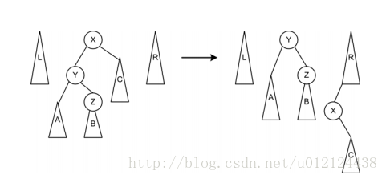
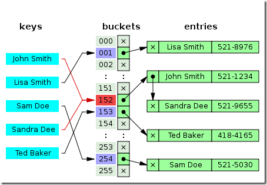

[数据结构与算法系列 目录](http://www.cnblogs.com/skywang12345/p/3603935.html)
[大佬的数据结构博客1](https://www.cnblogs.com/zhenghaotian/p/6740425.html)

**寻找环的入口点**
**KMP**
**重写strcpy**
**广义表**

满二叉树 完全二叉树 满完全二叉树 线索二叉树 二叉排序树 树 森林 B-树 B+树 B\*树 AVL树 伸展树 **2-3树** 红黑树 Trie树(字典树)

求两个节点的公共祖先 二叉树的节点的最大距离 二叉树中和为某一值的路径

[TOC]

### 链表

存储结构: 顺序存储结构(数组形式)、链式存储结构: 
```cpp
typedef struct node {
	int value;
	Node *next;
}node;
```

常见操作: 

- 插入、删除、查找、创建、验空、长度计算、反向逆置、正向与反向遍历、清空
- 验证链表是否有环: 使用一快一慢两指针遍历，看两指针是否相遇或者遇到NULL
- 倒数第M个节点: 两个指针，第一个先移动M次，然后两个一起移动，先移动的于东NULL时，后移动的指针所在位置就是第M个节点了
- 链表相交: 一指针沿着其中一链表走到尾节点处等着，另一链表的指针也从头走到尾，若能在尾处相遇，则两链表在某节点处相交
- 寻找相交节点: 可以遍历的过程中记录链表的长度L1和L2(假设L1>L2)，这时遍历找到第一个链表中的第L1 - L2节点，然后链表一从第L1-L2个节点开始遍历，
	链表二从第一个节点遍历，每次前进一步，直到找到第一个相同的节点，则可以认为两个链表存在相交节点，并且该点即为第一个相交节点。
	这种解法的时间复杂度也是线性的，但是如果两个链表长度相差不多时，时间复杂度还是不错的。
- **寻找环的入口点**: 
	1. 遍历链表，将已经遍历过的节点放在一个hash表中，如果一个节点已经存在hash表中，说明有环。时间:O(n) 空间:O(n)
	2. 寻找环的入口点: 当fast按照每次2步，slow每次一步的方式走，发现fast和slow重合，确定了单向链表有环路。接下来，让fast回到链表的头部，重新走，每次步长1，
		那么当fast和slow再次相遇的时候，就是环路的入口了。<br>
		证明: 在fast和slow第一次相遇的时候，假定slow走了n步，环路的入口是在p步，那么<br>
		slow走的路径: p+c ＝ n；c为fast和slow相交点 距离环路入口的距离<br>
		fast走的路径: p+c+k\*L = 2\*n；L为环路的周长，k是整数<br>
		显然，如果从p+c点开始，slow再走n步的话，还可以回到p+c这个点。同时，fast从头开始走，步长为1，经过n步，也会达到p+c这点。
		显然，在这个过程中fast和slow只有前p步骤走的路径不同。所以当p1和p2再次重合的时候，必然是在链表的环路入口点上。
- 有序列表的归并排序、交集(相等才输入)

单循环链表中最后一个节点指向头结点。

约瑟夫问题: 首先从一个人开始，越过k-2个人(因为第一个人已经被越过)，并杀掉第k个人。接着，再越过k-1个人，并杀掉第k个人。这个过程沿着圆圈一直进行，
直到最终只剩下一个人留下，这个人就可以继续活着。https://blog.csdn.net/leo_h1104/article/details/52915583

双向循环链表。

使用链表来实现单元多项式的加法、减法、乘法。一个单元多项式的节点结构无非是这样的: 系数域、指数域、链域。我们使用链表来模拟单元多项式的常见运算。
其中，加法是其它运算的基础，减法: poly1-poly2=poly1+(-poly2)，乘法: poly1\*poly2，可用poly1乘以poly2的每一项，相加其乘积结果。

### 栈、队列、优先级队列、双端队列

顺序**栈**的结构图定义
```cpp
typedef struct qstack{
	int data[maxsize];
	int top;
}qstack;
```

顺序栈的基本操作: 先存取，后移动指针。
```cpp
int stack[maxsize]; int top=-1;  // 初始化声明，注意，该方法会导致top指针指向第一个栈顶节点，而不是头结点
stack[++top]=x;  // 进栈
x=stack[top--];  // 出栈
stack.top==1;  // 验证空栈
stack.top==maxize-1;  // 验证满栈
```

链栈的结构定义
```cpp
typedef struct stackNode {
	int value;
	stackNode *next;
}stackNode;
```

链栈的基本操作
入栈: ``lst-next=p->next; lst->netx=p;``
出栈: ``x=lst->next; p=lst->next; lst->next=p->next; free(p);``

**队列**: 表尾入，表头出

- 顺序队列
	```cpp
	typedef struct queue {
		int data[MAXSIZE];
		int front;
		int rear;
	} queue;
	q.front == q.rear;  // 判空
	((q.rear + 1) % MAXSIZE) == q.front;  // 判断队列是否已满
	(q.rear - q.front + MAXSIZE) % MAXSIZE;  // 获取队列长度
	q.data[q.rear] = value; q.rear = (q.rear + 1) % MAXSIZE;  // 入队列
	value = q.data[q.front]; q.front = (q.front + 1) % MAXSIZE;  // 出队列
	```
- 链队列...

**栈和队列的应用**: 数制转换、括号匹配、后缀表达式求解，中缀表达式求解、双栈实现队列，min函数栈。
```cpp
void conversion(int num) {
	int stack[maxsize];
	int top = -1;
	while (num) {
		stack[++top] = a % b;
		a /= b;
	}
	while (top != -1) printf("%d", stack[top--]);
}

// 中缀表达式  (a + b + c * d) / e
// 前缀表达式  / + + a b * c d e   根左右
// 后缀表达式  a b c d * + + e /   左右跟
// 多个后缀表达式可能对应一个中缀表达式
// 后缀表达式在计算过程中，不需要计算运算符的优先级
// 【后缀表达式计算】: 1、取了数字则压栈  2、取了运算符则立即计算
// 【中缀表达式求解】: 1、取得数字则压操作数栈  2、取得运算符(判断优先是否大于运算符栈的顶部元素)？入操作符栈下一步: 
// 取值计算，相等的话，操作符出栈

// 已知下面Stack类及其3个方法Push、Pop和 Count，请用2个Stack实现Queue类的入队(Enqueue)出队(Dequeue)方法。
// 【一般思路】始终维护s1作为存储空间，以s2作为临时缓冲区。入队时，将元素压入s1。出队时，将s1的元素逐个"倒入"(弹出并
// 压入)s2，将s1的最后一个元素弹出作为出队元素。之后再将s2剩下的元素逐个"倒回"s1。
// 上述方法的变种: 【懒人操作-单栈法】适合连续出，或者连续入栈的操作。如果赶上下次还是出队操作，效率会高一些，但下次
// 如果是入队操作，效率不如第一种方法。
// 入队时，先判断s1是否为空，如不为空，说明所有元素都在s1，此时将入队元素直接压入s1；如为空，要将s2的元素逐个"倒回"s1
// ，再压入入队元素。
// 出队时，先判断s2是否为空，如不为空，直接弹出s2的顶元素并出队；如为空，将s1的元素逐个"倒入"s2，把最后一个元素弹出并出队。
// 性能较高的另一个变种: 【双栈共存法】入队时，将元素压入s1。出队时，判断s2是否为空，如不为空，则直接弹出顶元素；如为
// 空，则将s1的元素逐个"倒入"s2，把最后一个元素弹出并出队。

// 定义栈的数据结构，要求添加一个min函数，能够得到栈的最小元素。要求函数min、push以及pop的时间复杂度都是O(1)。
// 【思路1】: 使用一个辅助栈来保存最小元素，这个解法简单不失优雅。设该辅助栈名字为minimum stack，其栈顶元素为当前栈中的
// 最小元素。要获取当前栈中最小元素，只需要返回minimum stack的栈顶元素即可。每次执行push操作，检查push的元素是否小于或等
// 于minimum stack栈顶元素。如果是，则也push该元素到minimum stack中。
// (也可以是位置)；如果不是，再push一次栈顶元素；当执行pop操作的时候，每次pop一个元素出栈的时候，同时pop辅助栈。
// 【思路2】: 同样需要记录每插入一个值后最小值的位置(n个值就要记录n个最小位置)，但是这些最小位置不再放在一个辅助栈中，
// 而是在原来的栈节点的数据结构中加入一个指针变量(指向栈节点)，用来指示"此时"的最小值节点。
// 【思路3】: 用一个数来存储最小值
// 1.push时候 如果 value >= min, v_push 直接入栈，如果 value < min, 那么入栈的是 2 * value - min, 然后 min = value .
// 2.pop出时，如果栈顶的 stack[top] >= min 直接出，如果 stack[top] < min 则出现异常，将min作为pop的返回值，另外需要还原前
// 一个最小值: min = 2 * min - stack[top]
// 事实上，有如下规律:  (k为任意整数): 
// * push(v_push)时: 如果 v_push >= min, v_push 直接入栈；如果 v_push < min, 那么入栈的是 k * v_push - min, 然后 min =
// v_push. top++
// * Pop()时:如果栈顶的 stack[top] >= min 直接出;如果 stack[top] < min 则将min作为pop的返回值，再还原前一个最小值 min =
// k * min - stack[top]. top--
```

**优先级队列**: 和通常的栈和队列一样，只不过里面的每一个元素都有一个"优先级"，在处理的时候，首先处理优先级最高的。如果两个元素具有相同的优先级，
则按照他们插入到队列中的先后顺序处理。实现方式:

- 数组或链表:
	- 无序: 在数组末尾直接插入，O(1)，而查找最大值或者最小值则需要O(n)，删除最大元素也要O(n)，将最大元素的和边界元素交换后删除它。
	- 有序: 插入O(n)/O(lg2n)，查找与删除是O(1)
- 二叉堆: 近似完全二叉树的结构，并同时满足堆积的性质：即子结点的键值或索引总是小于(或者大于)它的父节点。用数组表示二叉堆时，元素k的父节点所在的位置为\[k/2\]，
	元素k的子节点所在的位置为2k和2k+1。插入和删除最大值都达到O(nlogn)的时间复杂度。最大元素已经位于根节点，那么删除操作就是移除并返回根节点元素，这时候二叉堆就需要重新排列；
	当插入新的元素的时候，也需要重新排列二叉堆以满足二叉堆的定义。<br>
	移除并返回最大元素操作DelMax可以变为：移除二叉堆根节点元素，并返回；将数组中最后一个元素放到根节点位置；然后对新的根节点元素进行Sink操作，直到满足二叉堆要求。<br>
- 多叉堆: 基于用数组表示的完全三叉树构造堆并修改相应的代码并不难，对应数组中1至N的N个元素，位置k的结点大于大于等于3k-1,3k，3k+1的结点，小于位于[(k+1)/3]下取整的结点。
- d叉堆: 完全d叉树，根最小。存储时使用层序。

双端队列: 两边都可以插入和删除的队列(可以用数组实现)

### 串

```c
// 顺序串
typedef struct seqstring {
	char chars[maxsize];
	int length;
} seqstring;
// 动态串
typedef struct seqstring {
	char *chars;
	int length;
} seqstring;
```

零个字符的串为空串；一到多个空格组成的串为空格串。

朴素模式匹配(O(M\*N)): 把模式串跟母串从左向右或从右向左一点一点比较: 先把模式串的第一个字符同母串的第一个字符比较，若相等则接着比较后面的对应字符；
若不等，把模式串后移一个位置，再次从模式串的头部比较……这如同枚举法: 把母串中与模式串相同长度的子串挨个比较。

KMP(O(M+N)): https://www.cnblogs.com/yjiyjige/p/3263858.html
```cpp
int KMP(string str, string pattern) {
	int str_size = str.size();
	int pattern_size = pattern.size();

	int *next = new int[pattern_size];
	next[0] = -1;
	int j = 0;
	int k = -1;
	while (j < pattern_size - 1) {
		if (k == -1 || pattern[j] == pattern[k])
			next[++j] = ++k;
		else
			k = next[k];
	}

	j = 0;	// 主串的位置
	k = 0;	// 模式串的位置
	while (j < str_size && k < pattern_size) {
		if (k == -1 || str[j] == pattern[k]) {
			j++;
			k++;
		} else
			k = next[k];
	}

	delete next;

	return k == pattern_size ? j - k : -1;
}
```

```cpp
// 一般情况下
char * strcpy (char *dst, const char *src) {
	assert(dst != NULL && src != NULL);
	char *ret = dst;
	while ((*dst++ = *src++) != '\0');
	return ret;
}
// 内存重叠: strcpy(s+1, s); //应返回hhello，但实际会报错，因为dst与src重叠了，把'\0'覆盖了；
// strcpy(s, s+1); //应返回ello
char * strcpy (char *dst, const char *src) {
	assert(dst != NULL && src != NULL);
	char *ret = dst;
	int len = strlen(src) + 1;
	if (dst >= src && dst <= src + len - 1) {
		dst = dst + len - 1;
		src = src + len - 1;
		while (len--) *dst-- = *src--;
	} else
		while (len--) *dst++ = *src++;
	return ret;
}
```

```cpp
// 【题目】把字符串中的每个空格替换成"%20"。例如输入"We are happy."，则输出"We%20are%20happy."
// 如果从前往后替换字符串，那么保存在空格后面的字符串肯定会被覆盖，那么我们就考虑从后往前进行替换。首先遍历原字符串，找出字符
// 串的长度以及其中的空格数量，根据原字符串的长度和空格的数量我们可以求出最后新字符串的长度。设置两个指针point1和point2分别
// 指向原字符串和新字符串的末尾位置。如果point1指向内容不为空格，那么将内容赋值给point2指向的位置，如果point1指向为空格，那
// 么从point2开始赋值"02%"。直到point1==point2时表明字符串中的所有空格都已经替换完毕。
int replaceSpace(char s[], int validLen) {
	int blockNumber = 0;
	int len = 0;
	while (s[len] != '\0')
		if (s[len++] == ' ')
			blockNumber++;
	int newLen = len + 2 * blockNumber;
	if (validLen < newLen) return -1;
	s[newLen] = '\0';
	int point1 = len - 1;
	int point2 = newLen - 1;
	while (point1 >= 0 && point1 < point2) {
		if (s[point1] == ' ') {
			s[point2--] = '0';
			s[point2--] = '2';
			s[point2--] = '%';
			point1--;
		} else
			s[point2--] = s[point1--];
	}
	return 1;
}
```

### 数组和广义表、并查集

- 数组表示: 行优先、列优先。https://blog.csdn.net/antkillerfarm/article/details/85229755。
- **对称压缩矩阵**: https://www.cnblogs.com/MrListening/p/5698121.html。特殊矩阵是指这样一类矩阵，其中有许多值相同的元素或有许多零元素，
	且值相同的元素或零元素的分布有一定规律。一般采用二维数组来存储矩阵元素。但是，对于特殊矩阵，可以通过找出矩阵中所有值相同元素的数学映射公式，
	只存储相同元素的一个副本，从而达到压缩存储数据量的目的。
- **稀疏矩阵**: ``c=t/(m*n)<=0.05``。https://www.cnblogs.com/Harley/p/5978868.html。

**广义表**是对线性表的扩展——线性表存储的所有的数据都是原子的(一个数或者不可分割的结构)，且所有的数据类型相同。而广义表是允许线性表容纳自身结构的数据结构。
广义表是由n个元素组成的序列: LS = (a1，a2, ... an); 其中ai是一个原子项或者是一个广义表。n是广义表的长度。若ai是广义表，则称为LS的子表。<br>
广义表表头和表尾: 若广义表LS不空，则a1，称为LS的表头，其余元素组成的子表称为表尾。<br>
广义表的长度: 若广义表不空，则广义表所包含的元素的个数，叫广义表的长度。()和(())不同，前者为空表，后者为有一个空元素的表。<br>
广义表的深度: 广义表中括号的最大层数叫广义表的深度。<br>

```cpp
// GetTail获取的是表，如果是元素，要放在表里
// GetHead获取是元素
GetTail[((a,b),(c,d))]=((c,d))
GetHead[GetTail[((a,b),(c,d))]]=(c.d)
GetTail[GetHead[GetTail[((a,b),(c,d))]]]=(d)
```

位图法: https://blog.csdn.net/the_blog_of_zbc/article/details/14056503<br>
[数组的相关算法](https://blog.csdn.net/fei20121106/article/details/45535889)<br>

```cpp
// 【题目】假设有长度分为为M和N的两个升序数组A和B，在A和B两个数组中查找第K大的数，即将A和B按升序合并后的第K个数。
// 解法一: 使用两个指针指向A和B的开头，很容易在O(M+N)的时间内完成，此算法略过。
// 解法二: 使用二分的方法。
...
```

**并查集**: 一种树型的数据结构,用于处理一些不相交集合(Disjoint Sets)的合并及查询问题。它主要支持两个操作，一个是union操作，即将两个不相交的集合的合并；
另一个是find操作，即查找该元素属于哪一个集合，以此衍生出来的一个操作是isConnected，也就是判断两个元素是否连接，即是否同属于一个集合中。一般使用数组实现。
https://blog.csdn.net/huisekonghuan/article/details/79288550

1. union: O(1) 先find，看看是否是同一颗树上的，可以使用**路径压缩**(查看中所有的节点的父节点都变为根节点)，如果不是同一个颗树，可以**按秩合并**。
2. find: O(1) 查看根节点，不断递归父节点，使用**路径压缩** 
3. isConnected: O(1) find(x) == find(y)
4. 可以看看有多少联通组件
5. 与最小堆一起实现最小生成树

### 树

#### 基本概念

```cpp
// 顺序存储
char btree[maxsize]
// 链式存储
typedef struct Node {
	char data;
	Node * left;
	Node * right;
}
```

- 树和二叉树的主要区别: 
	- 树中节点的最大度数没有限制，而二叉树节点的度不超过2。
	- 树中节点的孩子节点，无左右之分，而二叉树中是有区分的，即孩子是有区别的: 左孩子、右孩子，且次序不可颠倒。
	- 树的结点个数至少为1，而二叉树的结点个数可以为0。

满二叉树并不是完全二叉树的特例，因为满二叉树可以满在右边。满指的是K层的树有2[k]-1个节点，整个树挂满了节点。
而完全的含义则是最后一层没有满，其它层均满，且叶子节点都在最左边。https://blog.csdn.net/fei20121106/article/details/44242735(看看: 国内/外的满二叉树)

- 一些概念: 
	- 节点的度: 某节点的度定义为该节点孩子节点的个数。
	- 叶子节点: 度为0的节点。
	- **树的度**: 一棵树中，最大的节点的度称为树的度。
	- 节点的高度: 从该节点起到叶子节点的最长简单路径的边数。(简单路径: 无重复边的路径)
	- 节点的层数: 从根开始定义起，根为第1层，根的子节点为第2层，以此类推。
	- 节点的深度: 即该节点的层数。
	- 树的高度: 根节点的高度。
	- 树的层数: 根节点的层数。
	- 树的深度: 根节点的深度。
	- 外节点: 叶子节点。
	- 内节点: 除叶子节点之外的节点。
	- 满二叉树: 二叉树中节点的度只能是0或2。
	- 完全二叉树: 除最后一层，每一层的节点数都达到最大。最后一层若是没满，则节点集中在左边，空的只能是右边。
	- 扩充二叉树: 对二叉树中度为1的节点和叶子节点添加空节点，使之成为满二叉树。
- 一些定律: 
	- 对于二叉树，根节点是第一层，则第i层至多有2^(i-1)个结点。
	- 若共有k层，则最多有节点2^(k-1)个。
	- **给定N个节点，能构建F=C(n,2n)/(n+1)个不同的二叉树**
	- N个节点的完全二叉树高度为[上取整[log2(n+1)], 下取整[log2(n)]+1]
	- 总分支数=总节点数-1: 每一个分支都有一个结束节点
	- 二叉树中，叶子节点比度为2的节点多一个: 总节点数N0+N1+N2——>总分支数=N0+N1+N2-1=N1+2N2
	- 对于一棵满二叉树，外部节点或者说是叶子节点数是n，则内部节点数是n-1。

可以分析，当n=1时，只有1个根节点，则只能组成1种形态的二叉树，令n个节点可组成的二叉树数量表示为h(n)，则h(1)=1; h(0)=0;<br>
当n=2时，1个根节点固定，还有2-1个节点。这一个节点可以分成(1,0)，(0,1)两组。即左边放1个，右边放0个；或者左边放0个，右边放1个。
即: h(2)=h(0)\*h(1)+h(1)\*h(0)=2，则能组成2种形态的二叉树。<br>
当n=3时，1个根节点固定，还有2个节点。这2个节点可以分成(2,0)，(1,1)，(0,2)3组。即h(3)=h(0)\*h(2)+h(1)\*h(1)+h(2)\*h(0)=5，则能组成5种形态的二叉树。<br>
以此类推，当n>=2时，可组成的二叉树数量为h(n)=h(0)\*h(n-1)+h(1)\*h(n-2)+...+h(n-1)\*h(0)种，即符合Catalan数的定义，可直接利用通项公式得出结果。<br>
令h(1)＝1，h(0)=1，catalan数(**卡特兰数**)满足递归式: H()\*H()，即h(n)= h(0)\*h(n-1)+h(1)\*h(n-2) + ... + h(n-1)h(0) (其中n>=2)<br>
另类递归式: h(n)=((4\*n-2)/(n+1))\*h(n-1); 该递推关系的解为: h(n)=C(2n,n)/(n+1) (n=1,2,3,...)(其中C(2n,n)表示2n个中取n个的组合数)<br>
即公式为 (2n)! / (n! * (n + 1)!)
https://blog.csdn.net/hackbuteer1/article/details/7450250

#### 5.1 遍历

1. "先、中、后"遍历算法的统一递归写法
	```cpp
	void preOrder(Node *p) {
		if (p != NULL) {
			visit(p);
			pre(p->left);
			pre(p->right);
		}
	}
	void inOrder(Node *p) {
		if (p != NULL) {
			in(p->left);
			visit(p);
			in(p->right);
		}
	}
	void postOrder(Node *p) {
		if (!p) {
			postOrder(p->left);
			postOrder(p->right);
			visit(p);
		}
	}
	```
2. "先、中、后"遍历算法的非递归写法: 栈——向左压栈，退栈向右
	- 先: 左侧不断压栈到叶子，空了退栈向右，左侧不断压栈。压栈时输出
		先序遍历非递归实现: 输出，根节点不断入栈，向左遍历；不能向左时，退栈向右。
		```cpp
		void PreOrderTraverse(Node tree) {	// 非递归前序遍历
			if (!tree) {
				printf("空树！\n");
				return;
			}
			stack<Node> nodeStack;
			while (tree || !nodeStack.empty()) {
				while (tree) {
					printf("%c", tree->data);
					nodeStack.push(tree);
					tree = tree->left;
				}
				tree = nodeStack.top()->right;
				nodeStack.pop();
			}
		}
		```
	- 中: 左侧不断压栈到叶子，空了退栈向右，左侧不断压栈。退栈时输出
		中序遍历非递归实现: 根节点不断入栈，向左遍历；不能向左时，退栈，输出，向右遍历。
		```cpp
		void InOrderTraverse(Node tree) {	//非递归中序遍历
			if (!tree) {
				printf("空树！\n");
				return;
			}
			stack<Node> nodeStack;
			while (tree || ! nodeStack.empty()) {
				while (tree) {
					nodeStack.push(tree);
					tree = tree->left;
				}
				tree = nodeStack.top();
				nodeStack.pop();
				printf("%c", tree->data);
				tree = tree->right;
			}
		}
		```
	- 后: 左侧不断压栈到叶子，空或已访问了回栈，右侧不断压栈到叶子，空或已访问退栈，在退栈向右。第二次压栈时输出
		后序遍历非递归实现: 根节点入栈，向左遍历；左不能遍历则回退，向右，向右不能遍历时，退栈，输出，退栈右； +一个验证是否已经访问过。
		```cpp
		void PostOrderTraverse(Node tree) {	// 非递归后序遍历
			if (!tree) {
				printf("空树！\n");
				return;
			}
			stack<Node> nodeStack;
			while (tree || !nodeStack.empty()) {
				while (tree && notVisit(tree)) {
					nodeStack.push(tree);
					tree = tree->left;
				}
				tree = nodeStack.top();
				while (tree && notVisit(tree)) {
					nodeStack.push(tree);
					tree = tree->right;
				}
				tree = nodeStack.top();
				nodeStack.pop();
				printf("%c", tree->data);
				tree = nodeStack.top();
				tree = tree->right;
			}
		}
		```
3. **层次遍历**: 队列
	```cpp
	void PreOrderTraverse(Node tree) {
		if (!tree) {
			printf("空树！\n");
			return;
		}
		queue<Node> nodeQueue;
		nodeQueue.push(tree);
		while (tree && !nodeQueue.empty()) {
			tree = nodeQueue.pop();
			printf("%c", tree->data);
			if (tree->left) nodeQueue.push(tree->left);
			if (tree->right) nodeQueue.push(tree->right);
		}
	}
	```

```
(1)二叉树的创建: 创建一颗二叉树，可以创建先序二叉树，中序二叉树，后序二叉树。我们在创建的时候为了方便，不妨用" "表示空节点
(2)二叉树的节点个数: 空返0；else 树中的节点的个数 = 左子树中节点的个数 + 右子树节点的个数+1跟。
(3)二叉树某节点所在层数: 递归查找查找，lev++
(4)二叉树的深度: 空返0；叶子返1；else 树的高度 = max(左子树的高度，右子树的高度) + 1
(5)二叉树的叶子节点个数: 空返0；叶子返1；else 树中的叶子节点的个数 = 左子树中叶子节点的个数 + 右子树中叶子节点的个数
(6)完全二叉树的验证: 层次遍历；
	第一步: 如果遍历到一个节点只有右子树没有左子树，则不是完全二叉树
	第二步: 如果遍历到一个节点只有左子树，或没有子树，那么后面遍历到的节点必须是叶子节点，否则也不是完全二叉树
(7)判断一个节点是否在子树中: 递归遍历查找
(8)求两个节点的公共祖先: 
	(1)如果两个节点同时在根节点的右子树中，则最近公共祖先一定在根节点的右子树中。
	(2)如果两个节点同时在根节点的左子树中，则最近公共祖先一定在根节点的左子树中。
	(3)如果两个节点一个在根节点的右子树中，一个在根节点的左子树中，则最近公共祖先一定是根节点。
		当然，要注意的是: 可能一个节点pNode1在以另一个节点pNode2为根的子树中，这时pNode2就是这两个节点的最近公共祖先了。
(9)交换二叉树的左右儿子: 先交换根节点的左右儿子节点，然后递归以左右儿子节点为根节点继续进行交换
(10)二叉树的宽度: 
	算法1: 层次遍历实现，定义length为0-n的自减，记录每层个数=queue.size(); max始终记录最大值
	算法2: 递归实现: 每一个节点都导致下层的a[I]++ ；从左回右的时候 i--回退
(11)二叉树的节点的最大距离: 
	方法一: 递归法 -- 距离相差最远的两个结点，共有以下两种情况: 
		(1)路径经过根结点，所以两个结点在根结点的不同分支上
		(2)路径不经过根结点，所以两个结点应该是次根结点中相聚最远的两个结点。(递归思想)
		递归本质上还是采用了后续遍历的方法。由于是从叶子结点开始的所以每次处理都是第一种情况。
	方法二: 非递归法 -- 采用后序遍历二叉树的同时对二叉树的结点进行更新，每次更新都要更新最大距离。
(12)中序、先序遍历重建二叉树: 输入前序遍历与中序遍历结果重构二叉树。
(13)二叉树中和为某一值的路径: 输入一颗二叉树和一个整数，打印出二叉树中结点值的和为输入整数的所有路径。从树的根节点开始往下一
	直到叶结点所经过的所有的结点形成一条路径。
```

#### 5.2 线索二叉树、二叉排序树

https://baike.baidu.com/item/%E4%BA%8C%E5%8F%89%E6%A0%91/1602879?fr=aladdin#8<br>
https://baike.baidu.com/item/%E5%B9%B3%E8%A1%A1%E4%BA%8C%E5%8F%89%E6%A0%91/10421057<br>

n个结点的二叉链表中含有n+1个空指针域。利用二叉链表中的空指针域，存放指向结点在某种遍历次序下的**前趋和后继**结点的指针(这种附加的指针称为"线索")。
这种加上了线索的二叉链表称为线索链表，相应的二叉树称为**线索二叉树(Threaded BinaryTree)**。根据线索性质的不同，线索二叉树可分为前序线索二叉树、
中序线索二叉树和后序线索二叉树三种。**注意**: 线索链表解决了二叉链表找左、右孩子困难的问题，出现了无法直接找到该结点在某种遍历序列中的前趋和后继结点的问题。

线索链表的结点结构: 
```cpp
struct Node{
	char data;
	bool leftTag, rightTag;		// 用来区分结点的左、右指针域是指向其左、右孩子的指针，还是指向其前趋或后继的线索。
	bool leftChild, rightChild;
}
```

**二叉排序树**是一种动态树表。二叉排序树的定义: 二叉排序树或者是一棵空树，或者是一棵具有如下性质的二叉树: 

- 若它的左子树非空，则左子树上所有结点的值均小于根结点的值；
- 若它的右子树非空，则右子树上所有结点的值均大于根结点的值；
- 左、右子树本身又各是一棵二叉排序树。二叉排序树的性质: 按中序遍历二叉排序树，所得到的中序遍历序列是一个递增有序序列

在二叉排序树中插入新结点，要保证插入后的二叉树仍符合二叉排序树的定义。插入过程: 若二叉排序树为空，则待插入结点\*S作为根结点插入到空树中；
当非空时，将待插结点关键字S->key和树根关键字t->key进行比较，若s->key = t->key,则无须插入，若s->key< t->key,则插入到根的左子树中，
若s->key> t->key,则插入到根的右子树中。而子树中的插入过程和在树中的插入过程相同，如此进行下去，直到把结点\*s作为一个新的树叶插入到二叉排序树中，
或者直到发现树已有相同关键字的结点为止。

从空的二叉排序树开始，经过一系列的查找插入操作以后，生成了一棵二叉排序树。

- 每次插入的新结点都是二叉排序树上新的叶子结点。
- 由不同顺序的关键字序列，会得到不同二叉排序树。
- 对于一个任意的关键字序列构造一棵二叉排序树，其实质上对关键字进行排序。

在二叉排序树中进行查找的过程和二分查找类似，也是一个逐步缩小查找范围的过程。若查找成功，则是走了一条从根结点到待查结点的路径；
若查找失败，则是走了一条根结点到某个叶子结点的路径。因此，查找过程中和关键字比较的次数不超过树的深度。由于含有n个结点的二叉排序树不唯一，
形态和深度可能不同。故含有n个结点的二叉排序树的平均查找长度和树的形态有关。

- 最好的情况是: 二叉排序树和二叉判定树形态相同。
- 最坏的情况是: 二叉排序树为单支树，这时的平均查找长度和顺序查找时相同。
- 就平均性能而言，二叉排序树上的查找和二分查找相差不大，并且二叉排序树上的插入和删除结点十分方便，无须大量移动结点。  

二叉排序树的删除: 假设被删结点是\*p，其双亲是\*f，不失一般性，设\*p是\*f的左孩子，下面分三种情况讨论: 

- 若结点\*p是叶子结点，则只需修改其双亲结点\*f的指针即可。
- 若结点\*p只有左子树PL或者只有右子树PR，则只要使PL或PR成为其双亲结点的左子树即可。
- 若结点\*p的左、右子树均非空，先找到\*p的中序前趋结点\*s(注意\*s是\*p的左子树中的最右下的结点，它的右链域为空)，然后有两种做法: 
	- 令\*p的左子树直接链到\*p的双亲结点\*f的左链上,而\*p的右子树链到\*p的中序前趋结点\*s的右链上。
	- 以\*p的中序前趋结点\*s代替\*p(即把\*s的数据复制到\*p中)，将\*s的左子树链到\*s的双亲结点\*q的左(或右)链上。

二叉搜索树的后序遍历序列的验证: 由于二叉搜索树中某节点左子树最大值比节点值小，而右子树最大值比节点值大，所以后序遍历/中序/前序遍历都可轻易验证。

二叉搜索树与双向链表的转换: 输入一颗二叉搜索树，将该二叉搜索树转换成一个排序的双向链表。要求不能创建新的结点，只能调整树中结点指针的指向。
以中序遍历形式调整节点位置即可。

#### 5.3 树 森林和二叉树

1. **树变为二叉树**: 树中每个结点最多只有一个最左边的孩子(长子)和一个右邻的兄弟。按照这种关系很自然地就能将树转换成相应的二叉树: ①左孩子仍为左孩子；②右兄弟成为右孩子；
	1. 先根遍历
		1. 访问根结点；
		2. 按照从左到右的顺序先根遍历根结点的每一棵子树。
	2. 后根遍历
		1. 按照从左到右的顺序后根遍历根结点的每一棵子树。
		2. 访问根结点；
2. **森林转换为二叉树**: ①将森林中的每棵树变为二叉树；②因为转换所得的二叉树的根结点的右子树均为空，故可将各二叉树的根结点视为兄弟从左至右连在一起，就形成了一棵二叉树。
	1. 前序遍历
		1. 访问森林中第一棵树的根结点；
		2. 前序遍历第一棵树的根结点的子树；
		3. 前序遍历去掉第一棵树后的子森林。
	2. 中序遍历
		1. 中序遍历第一棵树的根结点的子树；
		2. 访问森林中第一棵树的根结点；
		3. 中序遍历去掉第一棵树后的子森林。
**树和森林的遍历**: 
3. 
	- 树的先根遍历=所转换二叉树的先序遍历
	- 树的后根遍历=所转换二叉树的中序遍历
	- 森林的遍历=所转换二叉树的遍历

#### 5.4 B-树和B+树、B树(即二叉搜索树)/B-树/B+树/B\*树

1. B-树是一种多路搜索树(并不是二叉的): 
	1. 特点: 
		1. 定义任意非叶子结点最多只有M个儿子；且M>2；
		2. 根结点的儿子数为[2, M]；
		3. 除根结点以外的非叶子结点的儿子数为[M/2, M]；
		4. 每个结点存放至少M/2-1(取上整)和至多M-1个关键字；(至少2个关键字)
		5. 非叶子结点的关键字个数=指向儿子的指针个数-1；
		6. 非叶子结点的关键字: K[1], K[2], …, K[M-1]；且K[i] < K[i+1]；
		7. 非叶子结点的指针: P[1], P[2], …, P[M]；其中P[1]指向关键字小于K[1]的子树，P[M]指向关键字大于K[M-1]的子树，其它P[i]指向关键字属于(K[i-1], K[i])的子树；
		8. 所有叶子结点位于同一层；
	2. 
	3. B-树的搜索，从根结点开始，对结点内的关键字(有序)序列进行二分查找，如果命中则结束，否则进入查询关键字所属范围的儿子结点；重复，直到所对应的儿子指针为空，或已经是叶子结点；
	4. B-树的特性: 
		1. 关键字集合分布在整颗树中；
		2. 任何一个关键字出现且只出现在一个结点中；
		3. 搜索有可能在非叶子结点结束；
		4. 其搜索性能等价于在关键字全集内做一次二分查找；
		5. 自动层次控制；
	5. 由于限制了除根结点以外的非叶子结点，至少含有M/2个儿子，确保了结点的至少利用率，其最底搜索性能为: <br><br>
		其中，M为设定的非叶子结点最多子树个数，N为关键字总数；所以B-树的性能总是等价于二分查找(与M值无关)，也就没有B树平衡的问题；
		由于M/2的限制，在插入结点时，如果结点已满，需要将结点分裂为两个各占M/2的结点；删除结点时，需将两个不足M/2的兄弟结点合并；
2. B+树是B-树的变体，也是一种多路搜索树，其定义基本与B-树同，除了: 
	1. 新特点: 
		1. 非叶子结点的子树指针与关键字个数相同；
		2. 非叶子结点的子树指针P[i]，指向关键字值属于[K[i], K[i+1])的子树(B-树是开区间)；
		3. 为所有叶子结点增加一个链指针；
		4. 所有关键字都在叶子结点出现；
	2. 
	3. B+的搜索与B-树也基本相同，区别是B+树只有达到叶子结点才命中(B-树可以在非叶子结点命中)，其性能也等价于在关键字全集做一次二分查找；
	4. B+的特性: 
		1. 所有关键字都出现在叶子结点的链表中(稠密索引)，且链表中的关键字恰好是有序的；
		2. 不可能在非叶子结点命中；
		3. 非叶子结点相当于是叶子结点的索引(稀疏索引)，叶子结点相当于是存储(关键字)数据的数据层；
		4. 更适合文件索引系统；
3. B\*树是B+树的变体，在B+树的非根和非叶子结点再增加指向兄弟的指针；
	1. 
	2. B\*树定义了非叶子结点关键字个数至少为(2/3)\*M，即块的最低使用率为2/3(代替B+树的1/2)；
	3. B+树的分裂: 当一个结点满时，分配一个新的结点，并将原结点中1/2的数据复制到新结点，最后在父结点中增加新结点的指针；
		B+树的分裂只影响原结点和父结点，而不会影响兄弟结点，所以它不需要指向兄弟的指针；<br>
		B\*树的分裂: 当一个结点满时，如果它的下一个兄弟结点未满，那么将一部分数据移到兄弟结点中，再在原结点插入关键字，
		最后修改父结点中兄弟结点的关键字(因为兄弟结点的关键字范围改变了)；如果兄弟也满了，则在原结点与兄弟结点之间增加新结点，并各复制1/3的数据到新结点，
		最后在父结点增加新结点的指针；<br>
		所以，B\*树分配新结点的概率比B+树要低，空间使用率更高；
4. 小结: 
	- B树: 二叉树，每个结点只存储一个关键字，等于则命中，小于走左结点，大于走右结点；
	- B-树: 多路搜索树，每个结点存储M/2到M个关键字，非叶子结点存储指向关键字范围的子结点；所有关键字在整颗树中出现，且只出现一次，非叶子结点可以命中；
	- B+树: 在B-树基础上，为叶子结点增加链表指针，所有关键字都在叶子结点中出现，非叶子结点作为叶子结点的索引；B+树总是到叶子结点才命中；
	- B\*树: 在B+树基础上，为非叶子结点也增加链表指针，将结点的最低利用率从1/2提高到2/3；
	- B树在经过多次插入与删除后，有可能导致不同的结构，甚至左子树高度远比右子树高度小也有可能。实际使用的B树都是在原B树的基础上加上平衡算法，即"平衡二叉树"；
		如何保持B树结点分布均匀的平衡算法是平衡二叉树的关键；平衡算法是一种在B树中插入和删除结点的策略；

#### 5.5 AVL树、伸展树、2-3树、红黑树、哈弗曼树(最优二叉树)、Treap树、Trie树(字典树)

[2-3树](https://blog.csdn.net/u012124438/article/details/78146200)

1. **AVL平衡二叉搜索树**
	1. 定义: 平衡二叉树或为空树，或为如下性质的二叉排序树:
		1. 左右子树深度之差的绝对值不超过1；
		2. 左右子树仍然为平衡二叉树。
	2. 平衡因子BF=左子树深度－右子树深度。平衡二叉树每个结点的平衡因子只能是1，0，-1。若其绝对值超过1，则该二叉排序树就是不平衡的。
		AVL平衡二叉树为了维护平衡，每次插入删除节点后如果不平衡了就需要旋转: 
		1. LL旋转: 由于 height(root->left->left) = height(root->left->right) + 1 = height(root->right) + 2
			```cpp
			newRoot = root->left;
			root->left = newRoot->right;
			newRoot->right = root;
			```
		3. RR旋转: 由于 height(root->right->right) = height(root->right->left) + 1 = height(root->left) + 2
			```cpp
			newRoot = root->right;
			root->right = newRoot->left;
			newRoot->left = root;
			```
		2. LR旋转: 由于 height(root->left->right) = height(root->left->left) + 1 = height(root->right) + 2
			```cpp
			root->left = RR(root->left)
			newRoot = LL(root)
			```
		4. RR旋转: 由于 height(root->right->left) = height(root->right->right) + 1 = height(root->left) + 2
			```cpp
			root->right = LL(root->right)
			newRoot = RR(root)
			```
2. **伸展树(Splay Tree)**是二叉查找树，而且当某个节点被访问时，伸展树会通过旋转使该节点成为树根。这样做的好处是，下次要访问该节点时，能够迅速的访问到该节点。
	1. 特性如下:
		1. 和普通的二叉查找树相比，具有任何情况下、任何操作的平摊O(log2n)的复杂度，时间性能上更好 
		2. 和一般的平衡二叉树比如 红黑树、AVL树相比，维护更少的节点额外信息，空间性能更优，同时编程复杂度更低 
		3. 在很多情况下，对于查找操作，后面的查询和之前的查询有很大的相关性。这样每次查询操作将被查到的节点旋转到树的根节点位置，这样下次查询操作可以很快的完成 
		4. 可以完成对区间的查询、修改、删除等操作，可以实现线段树和树状数组的所有功能
	2. 伸展树实现O(log2n)量级的平摊复杂度依靠每次对伸展树进行查询、修改、删除操作之后，都进行旋转操作Splay(x, root)，该操作将节点x旋转到树的根部。 
		伸展树的旋转有六种类型，如果去掉镜像的重复，则为三种: zig(zag)、zig-zig(zag-zag)、zig-zag(zag-zig)。
		1. 自底向上的方式进行旋转
			1. zig: <div align="center"></div>
				```cpp
				newRoot = root->left;
				root->left = newRoot->right;
				newRoot->right = root;
				```
			2. zig-zig: <div align="center"></div>
				```cpp
				zig(root);
				zig(root);
				```
			3. zig-zag: <div align="center"></div>
				```cpp
				zig(root->right);
				zag(root);
				```
		2. 自顶向下的方式进行旋转: 这种方式不需要节点存储其父节点的引用。当我们沿着树向下搜索某个节点x时，将搜索路径上的节点及其子树移走。构建两棵临时的树——左树和右树。
			没有被移走的节点构成的树称为中树。(1) 当前节点x是中树的根 (2) 左树L保存小于x的节点 (3) 右树R保存大于x的节点 。开始时候，x是树T的根，左树L和右树R都为空。
			1. zig: <div align="center"></div>
				```cpp
				```
			2. zig-zig: <div align="center"></div>
				```cpp
				```
			3. zig-zag: <div align="center"></div>
				```cpp
				```
			4. 合并: <div align="center"></div>
				```cpp
				```
3. **2-3树**是最简单的B-树，每个非叶节点都有两个或三个子女，而且所有叶都在统一层上。2-3树不是二叉树，其节点可拥有3个孩子。不过，2-3树与满二叉树相似。
	和二叉树不一样，2-3树运行每个节点保存1个或者两个的值。对于普通的2节点(2-node)，他保存1个key和左右两个自己点。对应3节点(3-node)，保存两个Key，2-3查找树的定义如下: 
[2-3树](https://blog.csdn.net/u012124438/article/details/78146200)

1. 2-节点保存一个key及对应value，以及两个指向左右节点的节点，左节点也是一个2-3节点，所有的值都比key要小，有节点也是一个2-3节点，所有的值比key要大。
2. 3-节点保存两个key及对应value，以及三个指向左中右的节点。左节点也是一个2-3节点，所有的值均比两个key中的最小的key还要小；
	中间节点也是一个2-3节点，中间节点的key值在两个跟节点key值之间；右节点也是一个2-3节点，节点的所有key值比两个key中的最大的key还要大。
3. 一棵2-3查找树或为一颗空树，或由以下节点组成:  
	1. 2-节点: 含有一个键和两条链接，左链接指向的2-3树中的键都小于该节点，右链接指向的2-3树中的键都大于该节点。 
	2. 3-节点: 含有两个键和三条链接，左链接指向的2-3树中的键都小于该节点，中链接指向的2-3树中的键都位于该节点的两个键之间，右链接指向的2-3树中的键都大于该节点。

如果中序遍历2-3查找树，就可以得到排好序的序列。在一个完全平衡的2-3查找树中，根节点到每一个为空节点的距离都相同。

1. 查找: 2-3树的查找效率与树的高度是息息相关的: 
	1. 在最坏的情况下，也就是所有的节点都是2-node节点，查找效率为lgN 
	2. 在最好的情况下，所有的节点都是3-node节点，查找效率为log3N约等于0.631lgN
2. 插入
	1. 往一个2-node节点插入新键，使它变为3-node。(树的初始态)
	2. 向一棵只含有一个3-节点的树中插入新键。假设这个节点能存放三个元素，暂时使其变成一个4-节点。然后将中间元素提升，左元素作为其左节点，右元素作为其右节点。(树的初始态)
	3. 向一个父节点为2-节点的3-节点中插入新键。使父节点变为3-节点，而另外两个值变为中间节点和边缘节点。(子树的分裂1)
	4. 向一个父节点为3-节点的3-节点中插入新建。当我们插入的节点是3-node的时候，我们将该节点拆分，中间元素提升至父节点，但是此时父节点是一个3-node节点，插入之后，
		父节点变成了4-node节点，然后继续将中间元素提升至其父节点，直至遇到一个父节点是2-node节点，然后将其变为3-node，不需要继续进行拆分。<br>
		当根节点到子节点都是3-node节点的时候，这是如果我们要在字节点插入新的元素的时候，会一直查分到跟节点，在最后一步的时候，跟节点变成了一个4-node节点，这个时候，
		就需要将跟节点查分为两个2-node节点，树的高度加1。(子树的分类2)
	5. 分解根节点。(树的向上生长态)

AVL是严格平衡树，因此在增加或者删除节点的时候，根据不同情况，旋转的次数比**红黑树(RB树)**要多；红黑是弱平衡的，用非严格的平衡来换取增删节点时候旋转次数的降低；
所以简单说，搜索的次数远远大于插入和删除，那么选择AVL树，如果搜索，插入删除次数几乎差不多，应该选择RB树。

红黑树上每个结点内含五个域，color(父节点指向它的连接的颜色/自己的颜色)，key，left，right，p。如果相应的指针域没有，则设为NIL。
一般的，红黑树，满足以下性质，即只有满足以下全部性质的树，我们才称之为红黑树: 

1. 每个结点要么是红的，要么是黑的。
2. 根结点是黑的。
3. 每个叶结点，即空结点(NIL)是黑的。
4. 如果一个结点是红的，那么它的俩个儿子都是黑的。
5. 对每个结点，从该结点到其子孙结点的所有路径上包含相同数目的黑结点。这个特性确保没有一条路径会比其他路径长出俩倍。因而，红黑树是相对是接近平衡的二叉树。

红黑树主要是对2-3查找树进行编码改进，尤其是对2-3查找树中的3-node节点添加额外的信息。红黑树将节点之间的链接分为两种不同类型，红链接用来链接两个2-node节点来表示一个3-node节点。
黑链接用来链接普通的2-3节点。特别的，使用红链接的两个2-node来表示一个3-nodes节点，并且向左倾斜，即一个2-node是另一个2-node的左子节点。
这种做法的好处是查找的时候不用做任何修改，和普通的二叉查找树相同。

红黑树是一种具有红色和黑色链接的平衡查找树，同时满足：

1. 红色节点向左倾斜 
2. 一个节点不可能有两个红色链接 
3. 整个树完全黑色平衡，即从根节点到所以叶子结点的路径上，黑色链接的个数都相同。

在介绍插入之前，我们先介绍如何让红黑树保持平衡，因为一般的，我们插入完成之后，需要对树进行平衡化操作以使其满足平衡化。

1. 左旋: newRoot = root->right; root->right = newRoot->left; newRoot->left = root;
	newRoot->color = root->color; root->color = RED; newRoot->nodeNum = root->nodeNum; root->nodeNum = 1 + size(root->left) + size(root->left)
2. 右旋: newRoot = root->left; root->left = newRoot->right; newRoot->right = root;
	newRoot->color = root->color; root->color = RED; newRoot->nodeNum = root->nodeNum; root->nodeNum = 1 + size(root->left) + size(root->left)
3. 颜色反转: 当出现一个临时的4-node的时候，即一个节点的两个子节点均为红色
	root->left->color = root->right->color = BLACK; root->color = RED;

现在看插入与删除这些:

1. 往一个2-node节点底部插入新的节点: 
	1. 新节点是左节点，则将该节点color=RED
	2. 新节点是右节点，则先将该节点右旋，将右旋后的左节点color=RED
2. 往一个3-node节点底部插入新的节点: 
	1. 插入的值比现有的两个节点都大: 则新节点是右节点，直接颜色反转
	2. 插入的值比现有的两个节点都小: 则新节点是左节点的左节点，则右旋，然后颜色反转
	3. 插入的值居中: 则新节点是左节点的右节点，则右旋，再左旋，然后颜色反转

插入的具体实现(有问题): 
```java
private Node insert(Node root, int value) {
	if (root == null) {
		return new Node(value, 1, RED);
	}
	if (value < root.value) {
		root.left = insert(root.left, value);
	} else if (value > root.value) {
		root.right = insert(root.right, value);
	} else {
		root.value = value;
		// throw new Exception("Can't insert obj that has been insrted");
	}
	if (!isRed(root.left) && isRed(root.right)) {
		root = rotateLeft(root);
	} else if (isRed(root.left) && isRed(root.left.left)) {
		root = rotateRight(root);
	} else if (isRed(root.left) && isRed(root.right)) {
		flipColors(root);
	}
	root._size = size(root->left) + size(root->right) + 1;
	return root;
}
```
5. **哈弗曼树(最优二叉树)**
6. **Treap树**
7. **Trie树(字典树)**，又称为单词查找树，是一种树形结构，它是一种哈希树的变种。https://www.cnblogs.com/xujian2014/p/5614724.html
	- 基本性质
		- 根节点不包含字符，除根节点外的每一个子节点都包含一个字符
		- 从根节点到某一节点。路径上经过的字符连接起来，就是该节点对应的字符串
		- 每个节点的所有子节点包含的字符都不相同
	- 应用: 典型应用是用于统计，排序和保存大量的字符串(不仅限于字符串)，经常被搜索引擎系统用于文本词频统计。
	- 优点: 利用字符串的公共前缀来减少查询时间，最大限度的减少无谓的字符串比较，查询效率比哈希树高。

#### 5.6 堆、二叉堆、d叉堆、左倾堆、斜堆(自适应堆)、二项堆、斐波那契堆

Floyd建堆算法（自下而上下滤）建立规模为n的完全二叉堆的时间复杂度为：O(n)。一般的暴力建堆算法（自上而下下滤）时间复杂度为：O（nlogn）。
https://www.cnblogs.com/shytong/p/5364470.html

1. **堆**作为一种树形结构，也是二叉树的一种应用。二叉搜索树是规定了节点之间的大小关系: 左孩子<根节点<右孩子。而堆中规定的节点之间的次序是: 
	根节点<左孩子，根节点<右孩子；根节点>左孩子，根节点>右孩子。前者我们称之为小顶堆，后者是大顶堆。不同的逻辑定义，会得到不同的性质。<br>
	堆是一种特殊的完全二叉树。通常所说的堆，就是指二叉堆。特殊是指它的节点大小次序是有规定的，但其本质还是一棵完全二叉树。而完全二叉树最常用的是顺序存储结构。
2. **左式堆**(leftist tree 或 leftist heap)，又被成为左偏树、左倾堆，最左堆等。和二叉堆一样，都是优先队列实现方式。当优先队列中涉及到"对两个优先队列进行合并"的问题时，
	二叉堆的效率就无法令人满意了，而左式堆则可以很好地解决这类问题。左倾树的节点除了和二叉树的节点一样具有左右子树指针外，还有两个属性: 键值(即存储的数据)和零距离。 <br>
	零距离(英文名NPL，即Null Path Length)则是从一个节点到一个"最近的不满节点"的路径长度。不满节点是指该该节点的左右孩子至少有有一个为NULL。叶节点的NPL为0，NULL节点的NPL为-1。
	1. 左式堆有以下几个基本性质: 
		- [性质1] 节点的键值小于或等于它的左右子节点的键值。 
		- [性质2] 节点的左孩子的NPL >= 右孩子的NPL。 
		- [性质3] 节点的NPL = 它的右孩子的NPL + 1。
	2. 合并操作是左倾堆的重点。合并两个左倾堆的基本思想如下:
		1. 如果一个空左倾堆与一个非空左倾堆合并，返回非空左倾堆。
		2. 如果两个左倾堆都非空，那么比较两个根节点，取较小堆的根节点为新的根节点。相当于将"较大堆"设置"较小堆"的右孩子。然后不断的将"较小堆的根节点的右孩子"和"较大堆"进行合并。
			https://blog.csdn.net/u012124438/article/details/78410468
		3. 如果新堆的右孩子的NPL > 左孩子的NPL，则交换左右孩子。
		4. 设置新堆的根节点的NPL = 右子堆NPL + 1。
3. **斜堆(Skew heap)**也叫自适应堆(self-adjusting heap)，是左斜堆的一个变种。和左倾堆一样，它通常也用于实现优先队列；作为一种自适应的左斜堆，它的合并操作的时间复杂度也是O(lg n)。
	1. 它与左斜堆的差别是:
		1. 斜堆的节点没有"零距离"这个属性，而左斜堆则有。
		2. 斜堆的合并操作和左倾堆的合并操作算法不同。
	2. 斜堆的合并操作
		1. 如果一个空斜堆与一个非空斜堆合并，返回非空斜堆。 
		2. 如果两个斜堆都非空，那么比较两个根节点，取较小堆的根节点为新的根节点。将”较小堆的根节点的右孩子”和”较大堆”进行合并。 
		3. 合并后，交换新堆根节点的左孩子和右孩子。 
	3. 第(3)步是斜堆和左倾堆的合并操作差别的关键所在，如果是左倾堆，则合并后要比较左右孩子的零距离大小，若右孩子的零距离 > 左孩子的零距离，则交换左右孩子；最后，在设置根的零距离。<br>
		由于合并都是沿著最右路径进行的,经过合并之后,新斜堆的最右路径长度必然增加,这会影响下一次合并的效率。所以合并后，通过交换左右子树,使整棵树的最右路径长度非常小（这是启发规则）。然而斜堆不记录节点的距离,在操作时,从下往上,沿著合并的路径,在每个节点处都交换左右子树。通过不断交换左右子树,斜堆把最右路径甩向左边了。
4. 


### 图

- 表现: 邻接矩阵、邻接表
- 深度优先、广度优先
- 分支定界搜索、有界搜索
- 最小生成树-Prim算法、最小生成树-Kruskal算法: <br>
	一无向带权图，顶点数是n，要使图连通只需n-1条边，若这n-1条边的权值和最小，则称有这n个顶点和n-1条边构成了图的**最小生成树**(minimum-cost spanning tree)。
	<br>**Prim算法**是解决最小生成树的常用算法。它采取贪心策略，从指定的顶点开始寻找最小权值的邻接点。图G=<V,E>，初始时S={V0}，把**与V0相邻接，且边的权值最小的顶点**加入到S。不断地把S中的顶点与V-S中顶点的最小权值边加入，直到所有顶点都已加入到S中。<br>
	**Kruskal算法**的做法是: 每次都从**剩余边中选取权值最小的**，当然，这条边不能使已有的边产生回路，即连接两个联通分量。算法逻辑人很容易理解，但用代码判断当前边是否会引起环的出现，则很棘手。为了判断环的出现，我们换个角度来理解Kruskal算法的做法: 初始时，把图中的n个顶点看成是独立的n个连通分量，
	从树的角度看，也是n个根节点。我们选边的标准是这样的: 若边上的两个顶点从属于两个不同的连通分量，则此边可取，否则考察下一条权值最小的边。
	于是问题又来了，如何判断两个顶点是否属于同一个连通分量呢？这个可以参照并查集的做法解决。它的思路是: 如果两个顶点的根节点是一样的，
	则显然是属于同一个连通分量。这也同样暗示着: 在加入新边时，要更新父节点。
	- Prim:
		1. 分为两部分: S V-S
		2. 不断从V-S中选择与S中节点相连的权值最小的边加入到S中，直到所有的点都加进来了，而且不会有回路
		```cpp
		int minTree(int n) {
			int i, j;
			memset(v, 0, sizeof(v));
			v[0] = 1;
			sum = 0;
			for(i = 1; i < n; i++) {
				min = max;
				for(j = 0; j < n; j++) {	 // 在剩余定点中，找到最小路径值的定点
					if(!v[j] && map[0][j] < min) {
						min = map[0][j];
						flag = j;
					}
				}
				sum += min;
				v[flag] = 1;
				for(j = 0; j < n; j++) {	// 加入新定点后，导致连通分量到其他顶点距离变化
					if(!v[j] && map[0][j] > map[flag][j])
						map[0][j]=map[flag][j];
				}
			}
			return sum;
		}
		```
	- Prim优化: 
	- Kruskal: 
		1. 将全部边按照权值由小到大排序。
		2. 按顺序(边权由小到大的顺序)考虑每条边，只要这条边和我们已经选择的边不构成圈，就保留这条边，否则放弃这条边。
		```cpp
		void Kruskal(MGraph G) {	//克鲁斯卡尔算法
			int set[10], i, j;
			int k = 0, a = 0, b = 0, min = G.arcs[0][0];
			for(i = 0; i < G.vexnum; i++)
				set[i] = i;					//初态，各顶点分别属于各个集合
			cout << "最小生成树的各条边为: " << endl;
			while(k < G.vexnum - 1) {		//最小生成树的边数等于顶点数-1
				for(i = 0; i < G.vexnum; i++){	//寻找最小权值的边，无向网，只在上三角形中查找
					for(j = i + 1; j < G.vexnum; j++)
						if(G.arcs[i][j] < min) {
							min = G.arcs[i][j];	//最小权值
							a = i;//边的一个顶点
							b = j;//边的另一个顶点
						}
				min = G.arcs[a][b] = 1000;	//避免下次查找
				if(set[a] != set[b]) {		//边的两个顶点不属于同一集合
					cout << G.vexs[a] << "-" << G.vexs[b] << endl;
					k++;					//边数加1
					for(i = 0; i < G.vexnum; i++)
						if(set[i] == set[b])//将顶点b所在集合并入顶点a集合
							set[i] = set[a];
				}
			}
		}
		```
	- Kruskal优化: 
		1. 每次取得权值最小的边: heap(最小堆)
		2. 判断加入的边的两个端点是否来自同一连通分量(实质就是保证加入边后不会产生回路): DisJointSet(并查集)
		```py
		def kruskal(self):
			if self.edge_num < self.node_num - 1:
				return []
			edges = copy.deepcopy(self.edges)
			edges.sort(key=lambda a: a[2])
			djset = DisJointSet(self.node_num)
			min_tree = []
			for edge in edges:
				i, j, weight = edge[0], edge[1], edge[2]
				r1, r2 = djset.find_set(i), djset.find_set(j)
				if r1 != r2:
					djset.union_set(r1, r2)
					min_tree.append(edge)
			return min_tree
		```
- 有向图的拓扑排序和验环: 
	1. 入度为0的点入栈
	2. 销毁节点，和与给节点相连的边
	3. 重复上过程，直到没有元素。若栈为空时，节点没有完全取出，则证明图中有环
	```cpp
	void Graph::topologicalSort() {
		int i, vertex;
		queue<int> q;
		//遍历，入度为零的顶点入队
		for (i = 0; i < numV; i++)
			if (indegree[i] == 0)
				q.push(i);
		bool *visited = new bool[numV];
		for (i = 0; i < numV; i++)
			visited[i] = false;
		while (!q.empty()) {
			vertex = q.front();
			q.pop();
			cout << setw(4) << vertex;
			visited[vertex] = true;
			for (i = 0; i < numV; i++)
				if (matrix[vertex][i] == 1) {
					//调整入度，入度为0则需入队
					if (!(--indegree[i]))
						q.push(i);
				}
		}
		cout << endl;
		for (i = 0; i < numV; i++)
			if (!visited[i])
				cout << "该有向图有环！";
		cout << endl;
		cout << "拓扑排序的一种结果: ";
		for (i = 0; q.size() > 1; i++) {
			cout << q.front() << " - ";
			q.pop();
		}
		cout << q.front() << endl;
		q.pop();
		delete[]visited;
	}
	```
- 单源最短路径-Dijkstra算法
	- 单源最短路径: 给定一带权图，图中每条边的权值是非负的，代表着两顶点之间的距离。指定图中的一顶点为源点，找出源点到其它顶点的最短路径和其长度的问题，
		即是单源最短路径问题。
	- Dijkstra算法: 求解单源最短路径问题的常用方法是Dijkstra(迪杰斯特拉)算法。该算法使用的是贪心策略: 每次都找出剩余顶点中与源点距离最近的一个顶点。<br>
		算法思想: 带权图G=<V,E\>，令S为已确定了最短路径顶点的集合，则可用V-S表示剩余未确定最短路径顶点的集合。假设V0是源点，则初始 S={V0}。
		用数组Distance表示源点V0到其余顶点的路径长度，用数组pre[i]表示最短路径序列上顶点i的前一个顶点。初始时，pre[i]都是源点的下标。接下来需重复两个步骤: 
		- 从当前Distance[i]找出最小的一个，记录其下标v=i，源点V0到顶点Vv的最短路径即已确定，把Vv加入S。
		- 更新源点到剩余顶点的最短路径长度。更新方法是: 以上一步的顶点Vv为中间点，若Distance[v]+weight(v,i)<Distance[i]，则修改值: 
			pre[i]=v;Distance[i]=Distance[v]+weight(v,i);

		重复以上两个步骤，直至所有顶点的最短路径都已找到。需要指出，Dijkstra算法求解的不仅是有向图，无向图也是可以的。
		```cpp
		#include<iostream>
		#include<iomanip>
		#include<stack>
		using namespace std;
		#define MAXWEIGHT 100

		#ifdef INFINITY
		#undef INFINITY
		#endif
		#define INFINITY 1000

		class Graph {
		private:
			// 顶点数
			int numV;
			// 边数
			int numE;
			// 邻接矩阵
			int **matrix;
		public:
			Graph(int numV);
			// 建图
			void createGraph(int numE);
			// 析构方法
			~Graph();
			// 迪杰斯特拉算法
			void Dijkstra(int);
			// 打印邻接矩阵
			void printAdjacentMatrix();
			// 检查输入
			bool check(int, int, int);
		};

		// ---------------------------------------- //
		//构造函数，指定顶点数目
		Graph::Graph(int numV) {
			//对输入的顶点数进行检测
			while (numV <= 0) {
				cout << "顶点数有误！重新输入 ";
				cin >> numV;
			}
			this->numV = numV;
			//构建邻接矩阵，并初始化
			matrix = new int*[numV];
			int i, j;
			for (i = 0; i < numV; i++)
				matrix[i] = new int[numV];
			for (i = 0; i < numV; i++)
				for (j = 0; j < numV; j++)
					matrix[i][i] = i == j ? 0 : INFINITY;
		}
		void Graph::createGraph(int numE) {
			/*
			* 对输入的边数做检测
			* 一个numV个顶点的有向图，最多有numV*(numV - 1)条边
			*/
			while (numE < 0 || numE > numV * (numV - 1)) {
				cout << "边数有问题！重新输入 ";
				cin >> numE;
			}
			this->numE = numE;
			int tail, head, weight, i;
			i = 0;
			cout << "输入每条边的起点(弧尾)、终点(弧头)和权值" << endl;
			while (i < numE) {
				cin >> tail >> head >> weight;
				while (!check(tail, head, weight)) {
					cout << "输入的边不正确！请重新输入 " << endl;
					cin >> tail >> head >> weight;
				}
				matrix[tail][head] = weight;
				i++;
			}
		}
		Graph::~Graph() {
			int i;
			for (i = 0; i < numV; i++)
				delete[] matrix[i];
			delete[]matrix;
		}
		/*
		* 迪杰斯特拉算法
		* 求指定顶点vertex到其它顶点的最短路径
		* 不仅要得出最短路径长度，也要得到其序列
		*/
		void Graph::Dijkstra(int vertex) {
			int i;
			//最短路径序列中每个顶点的直接前驱
			int *pre = new int[numV];
			for (i = 0; i < numV; i++)
				pre[i] = vertex;
			//顶点vertex到各个顶点的路径长度
			int *Distance = new int[numV];
			//初始化路径长度
			for (i = 0; i < numV; i++)
				Distance[i] = matrix[vertex][i];
			//标记各个顶点最短路径找到与否
			bool *find = new bool[numV];
			memset(find, 0, numV);
			find[vertex] = true;
			int d, v, count;
			count = 1, v = vertex;
			while (count < numV) {
				d = INFINITY;
				//确定一个最短距离
				for (i = 0; i < numV; i++)
					if (!find[i] && Distance[i] < d) {
						d = Distance[i];
						v = i;
					}
				find[v] = true;
				//更新剩余顶点的前驱和最短距离
				for (i = 0; i < numV; i++)
					if (!find[i]) {
						d = Distance[v] + matrix[v][i];
						if (d < Distance[i]) {
							pre[i] = v;
							Distance[i] = d;
						}
					}
				count++;
			}
			//打印最短路径序列和其长度
			stack<int> s;
			for (i = 0; i < numV; i++) {
				if (Distance[i] == 0);
				else if (Distance[i] == INFINITY)
					cout << "顶点 " << vertex <<" 到顶点 " << i <<" 无路径！" << endl;
				else {
					cout << "顶点 " << vertex << " 到顶点 " << i << " 最短路径长度是 "
						<< Distance[i] << " ，其序列是...";
					v = i;
					s.push(v);
					do {
						v = pre[v];
						s.push(v);
					} while (v!=vertex);
					//打印最短路径序列
					while (!s.empty()) {
						cout << setw(3) << s.top();
						s.pop();
					}
					cout << endl;
				}
			}
			cout << endl;
			delete[]find;
			delete[]pre;
			delete[]Distance;
		}
		//打印邻接矩阵
		void Graph::printAdjacentMatrix() {
			int i, j;
			cout.setf(ios::left);
			cout << setw(7) << " ";
			for (i = 0; i < numV; i++)
				cout << setw(7) << i;
			cout << endl;
			for (i = 0; i < numV; i++) {
				cout << setw(7) << i;
				for (j = 0; j < numV; j++)
					cout << setw(7) << matrix[i][j];
				cout << endl;
			}
		}
		bool Graph::check(int tail, int head, int weight) {
			return !(tail < 0 || tail >= numV || head < 0 || head >= numV || weight <= 0 || weight >= MAXWEIGHT)
		}
		```
	- bellman-ford算法(允许负权边的单源最短路径算法): 
		1. 初始化：将除起点s外所有顶点的距离数组置无穷大 d[v] = INF, d[s] = 0
		2. 迭代：遍历图中的每条边，对边的两个顶点分别进行一次松弛操作，直到没有点能被再次松弛
		3. 判断负圈：如果迭代超过V-1次，则存在负圈
	- spfa算法(其实是bellman-ford+队列优化,其实和bfs的关系更密一点)
- 点对之间最短距离-Floyd算法
	- Dijkstra算法是用于解决单源最短路径问题的，Floyd算法则是解决点对之间最短路径问题的。Floyd算法的设计策略是动态规划，而Dijkstra采取的是贪心策略。
		当然，贪心算法就是动态规划的特例。
	- 算法思想: 点对之间的最短路径只会有两种情况: ①两点之间有边相连，weight(Vi,Vj)即是最小的；②通过另一点: 中介点，两点相连，
		使weight(Vi,Vv)+weight(Vv,Vj)最小。Min_Distance(Vi,Vj)=min{weight(Vi,Vj),weight(Vi,Vv)+weight(Vv,Vj)}。正是基于这种背后的逻辑，再加上动态规划的思想，
		构成了Floyd算法。故当Vv取完所有顶点后，Distance(Vi,Vj)即可达到最小。Floyd算法的起点就是图的邻接矩阵。
		```cpp
		typedef struct {
			char vertex[VertexNum];							//顶点表
			int edges[VertexNum][VertexNum];				//邻接矩阵,可看做边表
			int n,e;										//图中当前的顶点数和边数
		} MGraph;
		void Floyd(MGraph g) {
			int A[MAXV][MAXV];
			int path[MAXV][MAXV];
			int i, j, k, n = g.n;
			for(i = 0; i < n; i++)
				for(j = 0; j < n; j++) {　　
					A[i][j] = g.edges[i][j];
					path[i][j] = -1;
				}
			for(k = 0; k < n; k++)
				for(i = 0; i < n; i++)
					for(j = 0; j < n; j++)
						if(A[i][j] > (A[i][k] + A[k][j])) {
							A[i][j] = A[i][k] + A[k][j];
							path[i][j] = k;
						}
		}
		```
- 关键路径: https://blog.csdn.net/qq_35644234/article/details/52664108、https://blog.csdn.net/fei20121106/article/details/44261917

### 散列表(哈希表)

https://www.cnblogs.com/yangecnu/p/Introduce-Hashtable.html

哈希表就是一种以 键-值(key-indexed) 存储数据的结构，我们只要输入待查找的值即key，即可查找到其对应的值。哈希的思路很简单，如果所有的键都是整数，
那么就可以使用一个简单的无序数组来实现: 将键作为索引，值即为其对应的值，这样就可以快速访问任意键的值。这是对于简单的键的情况，
我们将其扩展到可以处理更加复杂的类型的键。

使用哈希查找有两个步骤:

- 使用哈希函数将被查找的键转换为数组的索引。在理想的情况下，不同的键会被转换为不同的索引值，但是在有些情况下我们需要处理多个键被哈希到同一个索引值的情况，即哈希碰撞冲突。
- 处理哈希碰撞冲突。有很多处理哈希碰撞冲突的方法，本文后面会介绍拉链法和线性探测法。

哈希表是一个在时间和空间上做出权衡的经典例子。如果没有内存限制，那么可以直接将键作为数组的索引。那么所有的查找时间复杂度为O(1)；如果没有时间限制，
那么我们可以使用无序数组并进行顺序查找，这样只需要很少的内存。哈希表使用了适度的时间和空间来在这两个极端之间找到了平衡。只需要调整哈希函数算法即可在时间和空间上做出取舍。

哈希查找第一步就是使用哈希函数将键映射成索引。这种映射函数就是哈希函数。如果我们有一个保存0-M数组，
那么我们就需要一个能够将任意键转换为该数组范围内的索引(0 ~ M-1)的哈希函数。哈希函数需要易于计算并且能够均匀分布所有键。比如举个简单的例子，
使用手机号码后三位就比前三位作为key更好，因为前三位手机号码的重复率很高。再比如使用身份证号码出生年月位数要比使用前几位数要更好。
在实际中，我们的键并不都是数字，有可能是字符串，还有可能是几个值的组合等，所以我们需要实现自己的哈希函数。

- 获取正整数哈希值最常用的方法是使用**保留取余法**。即对于大小为素数M的数组，对于任意正整数k，计算k除以M的余数。M一般取素数。
- 将字符串作为键的时候，我们也可以将他作为一个大的整数，采用**保留除余法**。我们可以将组成字符串的每一个字符取值然后进行哈希，比如
	```java
	public int GetHashCode(string str) {
		char[] s = str.ToCharArray();
		int hash = 0;
		for (int i = 0; i < s.Length; i++)
			hash = s[i] + (31 * hash);
		return hash;
	}
	```
	上面的哈希值是Horner计算字符串哈希值的方法，公式为:
	h = s[0] · 31<sup>L–1</sup> + … + s[L – 3] · 31<sup>2</sup> + s[L – 2] · 31<sup>1</sup> + s[L – 1] · 31<sup>0</sup><br>
	举个例子，比如要获取"call"的哈希值，字符串c对应的unicode为99，a对应的unicode为97，l对应的unicode为108，所以字符串"call"的哈希值为
	3045982 = 99·31<sup>3</sup> + 97·31<sup>2</sup> + 108·31<sup>1</sup> + 108·31<sup>0</sup> = 108 + 31 · (108 + 31 · (97 + 31 · (99)))<br>
	如果对每个字符去哈希值可能会比较耗时，所以可以通过间隔取N个字符来获取哈西值来节省时间，比如，可以 获取每8-9个字符来获取哈希值: 
	```java
	public int GetHashCode(string str) {
		char[] s = str.ToCharArray();
		int hash = 0;
		int skip = Math.Max(1, s.Length / 8);
		for (int i = 0; i < s.Length; i+=skip)
			hash = s[i] + (31 * hash);
		return hash;
	}
	```

	但是，对于某些情况，不同的字符串会产生相同的哈希值，这就是前面说到的哈希冲突(Hash Collisions)。

避免哈希冲突

- **拉链法** (Separate chaining with linked lists): 通过哈希函数，我们可以将键转换为数组的索引(0-M-1)，但是对于两个或者多个键具有相同索引值的情况，
	我们需要有一种方法来处理这种冲突。一种比较直接的办法就是，将大小为M的数组的每一个元素指向一个条链表，链表中的每一个节点都存储散列值为该索引的键值对，
	这就是拉链法。下图很清楚的描述了什么是拉链法。<br><br>
	图中，"John Smith"和"Sandra Dee"通过哈希函数都指向了152 这个索引，该索引又指向了一个链表， 在链表中依次存储了这两个字符串。<br>
	该方法的基本思想就是选择足够大的M，使得所有的链表都尽可能的短小，以保证查找的效率。对采用拉链法的哈希实现的查找分为两步，
	首先是根据散列值找到等一应的链表，然后沿着链表顺序找到相应的键。<br>
	首先我们需要定义一个链表的总数，在内部我们定义一个SequentSearchSymbolTable的数组。然后每一个映射到索引的地方保存一个这样的数组。
	```c#
	public class SeperateChainingHashSet<TKey, TValue> : SymbolTables<TKey, TValue> where TKey : IComparable<TKey>, IEquatable<TKey> {
		private int M; //散列表大小
		private SequentSearchSymbolTable<TKey, TValue>[] st;
		public SeperateChainingHashSet(): this(997) {}
		public SeperateChainingHashSet(int m) {
			this.M = m;
			st = new SequentSearchSymbolTable<TKey, TValue>[m];
			for (int i = 0; i < m; i++)
				st[i] = new SequentSearchSymbolTable<TKey, TValue>();
		}
		private int hash(TKey key) {
			return (key.GetHashCode() & 0x7fffffff) % M;
			// hash方法来计算key的哈希值，这里首先通过取与&操作，将符号位去除，
			// 然后采用除留余数法将key应到到0-M-1的范围，这也是我们的查找表数组索引的范围。
		}
		public override TValue Get(TKey key) {
			return st[hash(key)].Get(key);
		}
		public override void Put(TKey key, TValue value) {
			st[hash(key)].Put(key, value);
		}
	}
	```

	实现基于拉链表的散列表，目标是选择适当的数组大小M，使得既不会因为空链表而浪费内存空间，也不会因为链表太而在查找上浪费太多时间。拉链表的优点在于，
	这种数组大小M的选择不是关键性的，如果存入的键多于预期，那么查找的时间只会比选择更大的数组稍长，另外，我们也可以使用更高效的结构来代替链表存储。
	如果存入的键少于预期，索然有些浪费空间，但是查找速度就会很快。所以当内存不紧张时，我们可以选择足够大的M，可以使得查找时间变为常数，如果内存紧张时，
	选择尽量大的M仍能够将性能提高M倍。

- **线性探测法**: 是开放寻址法解决哈希冲突的一种方法，基本原理为，使用大小为M的数组来保存N个键值对，其中M>N，我们需要使用数组中的空位解决碰撞冲突。如下图所示: 
	<br><br>对照前面的拉链法，在该图中，"Ted Baker" 是有唯一的哈希值153的，
	但是由于153被"Sandra Dee"占用了。而原先"Snadra Dee"和"John Smith"的哈希值都是152的，但是在对"Sandra Dee"进行哈希的时候发现152已经被占用了，
	所以往下找发现153没有被占用，所以存放在153上，然后"Ted Baker"哈希到153上，发现已经被占用了，所以往下找，发现154没有被占用，所以值存到了154上。<br>
	开放寻址法中最简单的是线性探测法: 当碰撞发生时即一个键的散列值被另外一个键占用时，直接检查散列表中的下一个位置即将索引值加1，这样的线性探测会出现三种结果: 
	①命中，该位置的键和被查找的键相同；②未命中，键为空；③继续查找，该位置和键被查找的键不同。<br>
	实现线性探测法也很简单，我们只需要两个大小相同的数组分别记录key和value。
	```c#
	public class LinearProbingHashSet<TKey, TValue> : SymbolTables<TKey, TValue> where TKey : IComparable<TKey>, IEquatable<TKey> {
		private int N;//符号表中键值对的总数
		private int M = 16;//线性探测表的大小
		private TKey[] keys;
		private TValue[] values;
		public LinearProbingHashSet() {
			keys = new TKey[M];
			values = new TValue[M];
		}
		private int hash(TKey key) {
			return (key.GetHashCode() & 0xFFFFFFF) % M;
		}
		public override TValue Get(TKey key) {
			for (int i = hash(key); keys[i] != null; i = (i + 1) % M)
				if (key.Equals(keys[i]))
					return values[i];
			return default(TValue);
		}
		public override void Put(TKey key, TValue value) {
			for (int i = hash(key); keys[i] != null; i = (i + 1) % M) {
				if (keys[i].Equals(key)) {   //如果和已有的key相等，则用新值覆盖
					values[i] = value;
					return;
				}
				//插入
				keys[i] = key;
				values[i] = value;
			}
		}
	}
	```
	线性探查(Linear Probing)方式虽然简单，但是有一些问题，它会导致同类哈希的聚集。在存入的时候存在冲突，在查找的时候冲突依然存在。

我们可以看到，哈希表存储和查找数据的时候分为两步，第一步为将键通过哈希函数映射为数组中的索引， 这个过程可以认为是只需要常数时间的。
第二步是，如果出现哈希值冲突，如何解决，前面介绍了拉链法和线性探测法下面就这两种方法进行讨论: 

- 对于拉链法，查找的效率在于链表的长度，一般的我们应该保证长度在M/8~M/2之间，如果链表的长度大于M/2，我们可以扩充链表长度。如果长度在0~M/8时，我们可以缩小链表。
- 对于线性探测法，也是如此，但是动态调整数组的大小需要对所有的值从新进行重新散列并插入新的表中。

不管是拉链法还是散列法，这种动态调整链表或者数组的大小以提高查询效率的同时，还应该考虑动态改变链表或者数组大小的成本。
散列表长度加倍的插入需要进行大量的探测， 这种均摊成本在很多时候需要考虑。


### 网络流

